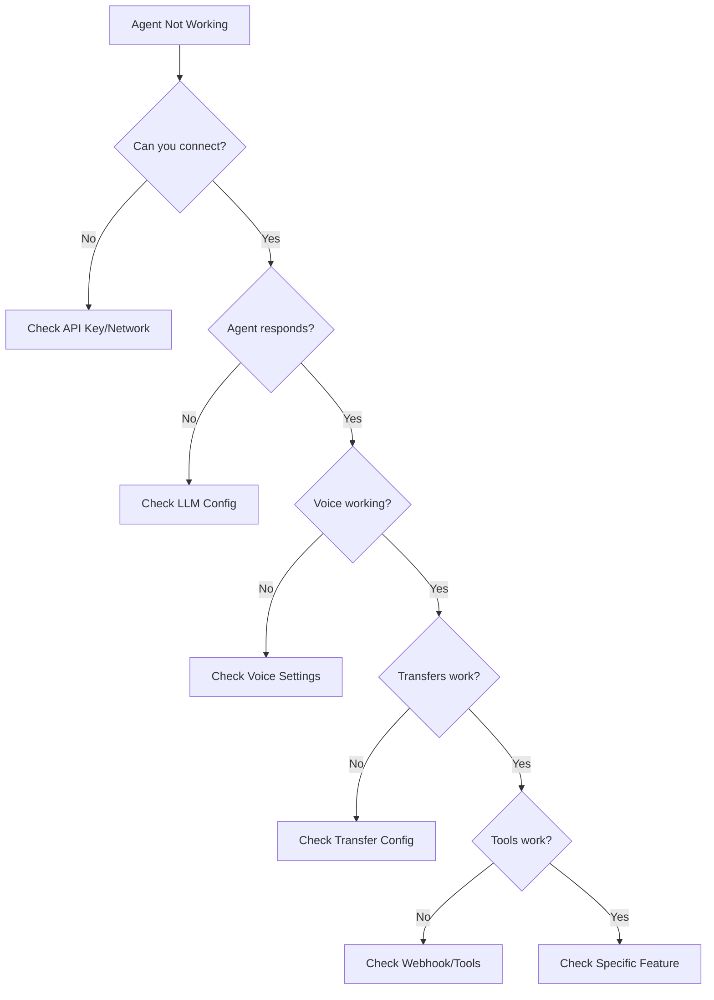

# ElevenLabs Troubleshooting Guide
*Comprehensive Solutions for Common Issues*

## Table of Contents
1. [Quick Diagnosis Flowchart](#quick-diagnosis-flowchart)
2. [System Variable Issues](#system-variable-issues)
3. [Transfer Problems](#transfer-problems)
4. [Voice & Audio Issues](#voice--audio-issues)
5. [Knowledge Base Problems](#knowledge-base-problems)
6. [Tool & Webhook Failures](#tool--webhook-failures)
7. [Performance Issues](#performance-issues)
8. [Data Collection Errors](#data-collection-errors)
9. [Multi-Language Issues](#multi-language-issues)
10. [SDK Integration Problems](#sdk-integration-problems)
11. [Emergency Troubleshooting](#emergency-troubleshooting)
12. [Debug Techniques](#debug-techniques)

---

## Quick Diagnosis Flowchart



---

## System Variable Issues

### Problem: Variables Show as Literal Text
**Symptom:** Agent says "{{system__time}}" instead of actual time

**Solutions:**
1. **Check Double Underscore**
   ```markdown
   ❌ WRONG: {{system_time}}
   ✅ RIGHT: {{system__time}}
   ```

2. **Verify Variable Names**
   ```markdown
   Valid system variables:
   - {{system__time}}
   - {{system__timezone}}
   - {{system__time_utc}}
   - {{system__caller_id}}
   - {{system__conversation_id}}
   - {{system__agent_id}}
   ```

3. **Don't Use in First Message**
   - Variables cause stumbling in initial greeting
   - Use static greeting instead

### Problem: Custom Variables Not Working
**Symptom:** Custom variables show as undefined

**Solutions:**
1. **Simple Embed Limitation**
   ```html
   <!-- Simple embed CANNOT use custom variables -->
   <elevenlabs-convai agent-id="agent_123"></elevenlabs-convai>
   ```

2. **Use SDK for Custom Variables**
   ```javascript
   window.ElevenLabsConvai.embed({
     agentId: 'agent_123',
     variables: {
       business_name: 'ACME Corp',
       business_hours: '9-5'
     }
   });
   ```

### Problem: Time Shows Wrong Timezone
**Symptom:** Time variable incorrect for caller location

**Solution:**
- Use `{{system__time}}` for local time
- Use `{{system__time_utc}}` for UTC
- Check `{{system__timezone}}` to verify

---

## Transfer Problems

### Problem: Transfer Fails Silently
**Symptom:** Agent says transferring but nothing happens

**Solutions:**

1. **Check "Enable First Message" Toggle**
   ```yaml
   Receiving Agent Settings:
   ✅ Enable First Message: ON
   ```

2. **Verify Agent ID**
   ```javascript
   // Get correct ID from dashboard
   "agent_id": "agent_8801k2px9ch5ee2bs65xwwhdzcjq"
   ```

3. **Test Transfer Conditions**
   ```markdown
   Good condition:
   "User mentions booking, appointment, schedule, wants to book"
   
   Bad condition:
   "booking" (too simple, may not trigger)
   ```

### Problem: Wrong Agent Receives Transfer
**Symptom:** Booking request goes to technical expert

**Solutions:**
1. **Review Transfer Priority**
   - Check order of transfer rules
   - More specific conditions first
   - General conditions last

2. **Make Conditions Mutually Exclusive**
   ```markdown
   Booking: "appointment, schedule, book a time"
   Technical: "how does, why does, explain the"
   Emergency: "flood, burst, gas leak, urgent"
   ```

### Problem: Context Lost After Transfer
**Symptom:** New agent doesn't know previous conversation

**Solutions:**
1. **Enable Context Preservation**
   - Check transfer tool settings
   - Ensure "Include Context" is enabled

2. **Use Transfer Messages**
   ```markdown
   "Transferring you to our booking specialist. 
   They'll have all your information..."
   ```

---

## Voice & Audio Issues

### Problem: Robotic or Unnatural Voice
**Symptom:** Voice sounds mechanical

**Solutions:**
1. **Adjust Stability Setting**
   ```json
   {
     "stability": 0.4,  // Lower = more natural
     "similarity_boost": 0.8
   }
   ```

2. **Check Voice Model**
   ```
   Recommended: eleven_turbo_v2
   For quality: eleven_multilingual_v2
   ```

### Problem: Voice Cutting Out
**Symptom:** Speech interruptions or dropouts

**Solutions:**
1. **Audio Format Optimization**
   ```json
   {
     "user_input_audio_format": "pcm_16000",
     "optimize_streaming_latency": 3
   }
   ```

2. **Network Checks**
   - Test bandwidth (minimum 100kbps)
   - Check firewall/proxy settings
   - Try different network

### Problem: Echo or Feedback
**Symptom:** Agent hears itself

**Solutions:**
1. **Enable Echo Cancellation**
   ```json
   {
     "echo_cancellation": true,
     "noise_suppression": true,
     "auto_gain_control": true
   }
   ```

2. **Adjust Turn Management**
   ```json
   {
     "interruption_sensitivity": 0.3,
     "turn_timeout": 60
   }
   ```

### Problem: Pronunciation Errors
**Symptom:** Technical terms mispronounced

**Solution:** Create Pronunciation Dictionary
```xml
<?xml version="1.0" encoding="UTF-8"?>
<lexicon version="1.0" 
         xmlns="http://www.w3.org/2005/01/pronunciation-lexicon"
         alphabet="ipa" xml:lang="en-US">
  <lexeme>
    <grapheme>nginx</grapheme>
    <phoneme>ˈɛndʒɪn ɛks</phoneme>
  </lexeme>
</lexicon>
```

---

## Knowledge Base Problems

### Problem: RAG Not Finding Information
**Symptom:** Agent can't access knowledge base content

**Solutions:**
1. **File Format Check**
   ```yaml
   Supported formats:
   ✅ PDF, DOCX, TXT, HTML, EPUB
   ❌ Markdown (convert to .txt first)
   ```

2. **Enable RAG**
   ```json
   {
     "use_rag": true,
     "search_threshold": 0.6
   }
   ```

3. **Test Search Terms**
   - Include relevant keywords in documents
   - Use headers for sections
   - Avoid technical jargon in queries

### Problem: Wrong Information Retrieved
**Symptom:** RAG returns irrelevant content

**Solutions:**
1. **Adjust Search Threshold**
   ```json
   {
     "search_threshold": 0.8  // Higher = more strict
   }
   ```

2. **Organize Content Better**
   - Separate topics into different files
   - Use clear headers
   - Remove duplicate information

### Problem: Upload Fails
**Symptom:** Knowledge base files won't upload

**Solutions:**
1. **Check File Size**
   - Maximum: 10MB per file
   - Split large documents

2. **Verify Format**
   ```bash
   # Convert markdown to text
   mv guide.md guide.txt
   ```

3. **Remove Special Characters**
   - Avoid emoji in documents
   - Check for encoding issues

---

## Tool & Webhook Failures

### Problem: Webhook Not Triggering
**Symptom:** External tools don't execute

**Solutions:**
1. **Verify URL**
   ```json
   {
     "url": "https://n8n.company.com/webhook/abc123",
     "method": "POST"
   }
   ```

2. **Check HTTPS**
   - Must use HTTPS (not HTTP)
   - Valid SSL certificate required

3. **Test Webhook Independently**
   ```bash
   curl -X POST https://your-webhook-url \
     -H "Content-Type: application/json" \
     -d '{"test": "data"}'
   ```

### Problem: Tool Parameters Missing
**Symptom:** Tool executes but fails

**Solutions:**
1. **Define Required Parameters**
   ```json
   {
     "parameters": [
       {
         "name": "date",
         "type": "string",
         "required": true
       }
     ]
   }
   ```

2. **Add Validation**
   ```javascript
   if (!params.date) {
     return { error: "Date is required" };
   }
   ```

### Problem: Timeout Errors
**Symptom:** Webhook times out

**Solutions:**
1. **Optimize Response Time**
   - Webhook must respond within 10 seconds
   - Use async processing for long tasks

2. **Return Acknowledgment**
   ```javascript
   // Immediate response
   res.status(200).json({ 
     status: "processing",
     message: "Checking availability..." 
   });
   ```

---

## Performance Issues

### Problem: Slow Response Time
**Symptom:** Agent takes too long to respond

**Solutions:**
1. **Choose Appropriate Model**
   ```yaml
   Fast: gemini-2.5-flash-lite
   Balanced: gemini-2.5-flash
   Complex: gemini-2.5-pro
   ```

2. **Reduce Token Usage**
   ```json
   {
     "max_tokens": 150,  // Lower for faster
     "temperature": 0.3
   }
   ```

3. **Optimize Audio Settings**
   ```json
   {
     "optimize_streaming_latency": 4,
     "user_input_audio_format": "pcm_16000"
   }
   ```

### Problem: High Latency
**Symptom:** Noticeable delay in conversation

**Solutions:**
1. **Check Network**
   ```bash
   ping api.elevenlabs.io
   # Should be < 100ms
   ```

2. **Use Nearest Region**
   - Configure region in account settings
   - Use CDN if available

### Problem: Agent Crashes
**Symptom:** Conversation ends unexpectedly

**Solutions:**
1. **Check Max Duration**
   ```json
   {
     "max_conversation_duration": 600  // 10 minutes
   }
   ```

2. **Monitor Resource Usage**
   - Check concurrent conversation limit
   - Review account quotas

---

## Data Collection Errors

### Problem: Fields Not Collected
**Symptom:** Required data missing

**Solutions:**
1. **Define Clear Schema**
   ```json
   {
     "data_collection": [
       {
         "type": "string",
         "identifier": "name",
         "prompt": "Extract customer's full name"
       }
     ]
   }
   ```

2. **Add Validation Prompts**
   ```markdown
   "If name not provided, ask: 'May I have your name please?'"
   ```

### Problem: Wrong Data Format
**Symptom:** Phone numbers, emails incorrect

**Solutions:**
1. **Specify Format in Prompt**
   ```markdown
   "Extract phone in format: 0411-234-567"
   "Email must include @ symbol"
   ```

2. **Use Correct Data Type**
   ```json
   {
     "type": "string",  // For phone numbers
     "type": "boolean", // For yes/no
     "type": "integer", // For counts
     "type": "number"   // For decimals
   }
   ```

---

## Multi-Language Issues

### Problem: Language Not Detected
**Symptom:** Agent doesn't switch languages

**Solutions:**
1. **Enable Language Detection**
   ```json
   {
     "auto_detect_language": true,
     "detection_confidence": 0.7
   }
   ```

2. **Configure Additional Languages**
   ```json
   {
     "default_language": "en-US",
     "additional_languages": ["es-ES", "fr-FR"]
   }
   ```

### Problem: Wrong Language Response
**Symptom:** Agent responds in wrong language

**Solutions:**
1. **Set Fallback Language**
   ```json
   {
     "fallback_language": "en-US"
   }
   ```

2. **Adjust Detection Threshold**
   ```json
   {
     "detection_confidence": 0.8  // Higher = more certain
   }
   ```

---

## SDK Integration Problems

### Problem: Widget Won't Load
**Symptom:** Embed code doesn't work

**Solutions:**
1. **Check Script Order**
   ```html
   <!-- Correct order -->
   <elevenlabs-convai agent-id="agent_123"></elevenlabs-convai>
   <script src="https://unpkg.com/@elevenlabs/convai-widget-embed" 
           async type="text/javascript"></script>
   ```

2. **Verify Agent ID**
   - Copy exact ID from dashboard
   - Check for typos

### Problem: Custom Styling Not Applied
**Symptom:** Widget looks wrong

**Solution:** Use SDK for Styling
```javascript
window.ElevenLabsConvai.embed({
  agentId: 'agent_123',
  ui: {
    theme: 'dark',
    position: 'bottom-right',
    colors: {
      primary: '#007bff'
    }
  }
});
```

### Problem: Events Not Firing
**Symptom:** Can't track conversation events

**Solution:** Register Event Handlers
```javascript
const agent = await ElevenLabsConvai.create({
  agentId: 'agent_123',
  onConnect: () => console.log('Connected'),
  onMessage: (msg) => console.log('Message:', msg),
  onError: (err) => console.error('Error:', err)
});
```

---

## Emergency Troubleshooting

### Critical Issues Checklist

#### Agent Completely Down
1. **Check API Status**
   - Visit status.elevenlabs.io
   - Check service health

2. **Verify API Key**
   ```javascript
   // Test API key
   curl -H "xi-api-key: YOUR_KEY" \
     https://api.elevenlabs.io/v1/user
   ```

3. **Account Issues**
   - Check billing status
   - Verify usage limits
   - Review account suspension

#### Production Emergency
1. **Immediate Actions**
   ```yaml
   1. Switch to backup agent
   2. Enable human fallback
   3. Notify stakeholders
   4. Begin diagnosis
   ```

2. **Rollback Procedure**
   ```bash
   # Revert to last working version
   git checkout last-known-good
   # Redeploy previous agent config
   ```

3. **Emergency Contacts**
   - Support: support@elevenlabs.io
   - Status: status.elevenlabs.io
   - Community: Discord/Slack

---

## Debug Techniques

### Enable Debug Mode

#### Client Events for Debugging
```json
{
  "client_events": {
    "vad_score": true,
    "latency_measurement": true,
    "network_stats": true,
    "debug_logs": true
  }
}
```

### Conversation Analysis

#### Review Transcripts
1. Go to History tab
2. Check for:
   - Incomplete responses
   - Transfer failures
   - Tool execution errors
   - Timeout issues

#### Check Evaluation Results
```markdown
Look for patterns in:
- Failure reasons
- Unknown results
- Consistent issues
```

### Testing Framework

#### Systematic Testing
```python
test_cases = [
    "Basic greeting",
    "Information request",
    "Transfer trigger",
    "Emergency detection",
    "Data collection",
    "Tool execution",
    "Error handling",
    "Conversation end"
]

for test in test_cases:
    result = test_agent(test)
    log_result(result)
```

### Log Analysis

#### Key Log Points
1. **Connection logs** - Initial setup
2. **LLM requests** - Model interactions
3. **Tool executions** - External calls
4. **Transfer events** - Agent handoffs
5. **Error messages** - Failures
6. **Performance metrics** - Latency

#### Using Browser Console
```javascript
// Enable verbose logging
localStorage.setItem('elevenlabs_debug', 'true');

// Monitor WebSocket
ws.addEventListener('message', (event) => {
  console.log('WebSocket message:', event.data);
});
```

### Common Error Messages

| Error | Meaning | Solution |
|-------|---------|----------|
| "Invalid agent ID" | Agent not found | Verify ID from dashboard |
| "Rate limit exceeded" | Too many requests | Implement throttling |
| "Webhook timeout" | External service slow | Optimize webhook response |
| "Voice not available" | Voice ID invalid | Check voice library |
| "Transfer failed" | Target agent issue | Verify transfer config |
| "Context too long" | Token limit exceeded | Reduce prompt size |
| "Audio format error" | Unsupported format | Use PCM 16000 Hz |

---

## Prevention Strategies

### Pre-Launch Checklist
```markdown
- [ ] Test all transfer paths
- [ ] Verify webhook endpoints
- [ ] Check voice availability
- [ ] Test with various inputs
- [ ] Review error handling
- [ ] Confirm fallback paths
- [ ] Test edge cases
- [ ] Load test if needed
- [ ] Document known issues
- [ ] Prepare rollback plan
```

### Monitoring Setup
```yaml
Monitor these metrics:
- Response time (target: <2s)
- Transfer success rate (>95%)
- Tool execution success (>90%)
- Error rate (<2%)
- Conversation completion (>80%)
- User satisfaction scores
```

### Regular Maintenance
```markdown
Weekly:
- Review error logs
- Check evaluation results
- Update knowledge base
- Test critical paths

Monthly:
- Full system test
- Performance review
- Update documentation
- Review and optimize prompts
```

---

## Getting Help

### Self-Service Resources
1. **Documentation**: docs.elevenlabs.io
2. **API Reference**: api.elevenlabs.io
3. **Status Page**: status.elevenlabs.io
4. **Community Forum**: Discord/Slack

### Support Channels
1. **Email**: support@elevenlabs.io
2. **Dashboard**: Support widget
3. **Emergency**: Account manager contact

### When Contacting Support

**Provide:**
- Agent ID
- Conversation ID (if applicable)
- Error messages
- Steps to reproduce
- Expected vs actual behavior
- Screenshots/recordings
- Time and timezone of issue

**Example Support Request:**
```markdown
Subject: Transfer Failure - Agent abc123

Agent ID: agent_8801k2px9ch5ee2bs65xwwhdzcjq
Conversation ID: conv_xyz789
Time: 2025-08-15 14:30 AEST

Issue: Transfer to booking agent fails silently

Steps to reproduce:
1. Start conversation
2. Say "I want to book an appointment"
3. Agent says transferring but stays connected

Expected: Transfer to booking agent
Actual: Remains with main agent

Error in console: "Transfer target not found"
```

---

*Last Updated: 2025-08-15*
*Version: 2.0*
*Maintainer: jeremy@jezweb.net*