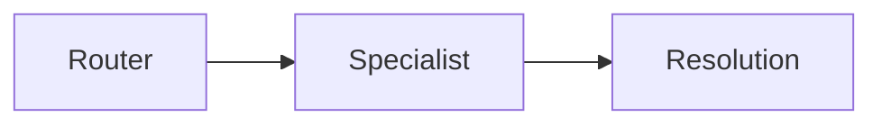
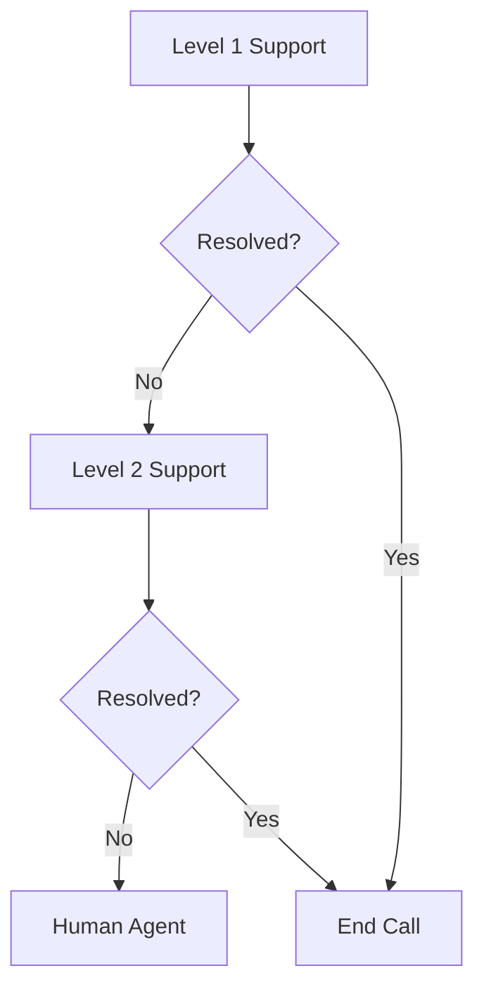
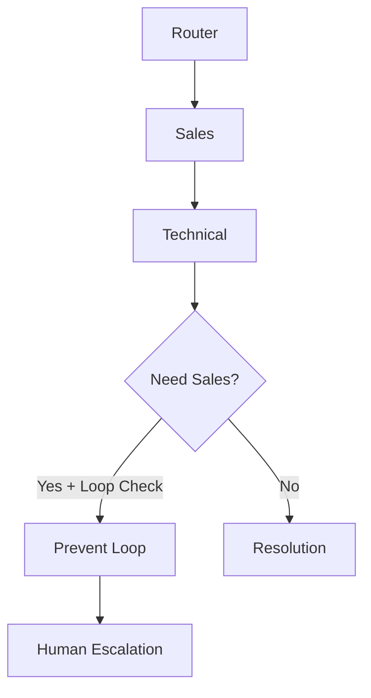

# Transfer Configuration Guide for ElevenLabs Agents

## Overview

Transfer configuration is critical for multi-agent systems and human escalation. Proper setup ensures smooth handoffs, context preservation, and positive user experience during transitions.

## Transfer Types

### 1. Agent-to-Agent Transfer
Handoff between AI agents in your system

### 2. Agent-to-Human Transfer  
Escalation to human representatives via phone number

### 3. Conditional Routing
Dynamic transfer based on business logic

---

## Agent-to-Agent Transfer Configuration

### Basic Setup

```yaml
transfer_to_ai_agent:
  enabled: true
  
agents:
  - agent_id: "agent_8801k2px9ch5ee2bs65xwwhdzcjq"
    name: "Booking Specialist"
    description: "Handles all appointment scheduling"
    
  - agent_id: "agent_7702m3qy8dh6ff3ct76yxxiezdk"  
    name: "Technical Support"
    description: "Resolves technical issues"
    
  - agent_id: "agent_9903n4rz9ei7gg4du87zyyjeael"
    name: "Billing Department"
    description: "Handles payments and invoices"
```

### Transfer Rules

#### Natural Language Conditions

```markdown
## GOOD TRANSFER CONDITIONS ✅

Specific and comprehensive:
"Customer mentions booking, appointment, schedule, calendar, 
availability, time slot, reschedule, cancel appointment, 
when can you come, are you free, next available"

Multiple variations covered:
"Technical issue, not working, broken, error message, 
malfunction, stopped working, won't turn on, crashed, 
frozen, slow, glitching"

Context-aware:
"Customer upset and asking for manager, demanding supervisor, 
wants to complain, threatening to cancel, extremely frustrated"
```

```markdown
## BAD TRANSFER CONDITIONS ❌

Too vague:
"Customer needs help"
"Has a question"
"Wants information"

Too specific:
"Customer says exactly 'I want to book'"
"Uses the word 'appointment' only"

No variations:
"booking"  # Missing schedule, calendar, etc.
```

### Transfer Messages

#### Customer-Facing Messages

```yaml
transfer_messages:
  booking:
    message: "I'll connect you with our scheduling specialist who can find the perfect time for you."
    duration: "This will just take a moment..."
    
  support:
    message: "Let me get our technical expert to help with this issue."
    context: "They'll have all the details we've discussed."
    
  billing:
    message: "I'll transfer you to our billing team who can help with that."
    assurance: "They'll be able to resolve this quickly."
    
  emergency:
    message: "This needs immediate attention. Connecting you now..."
    urgency: "Please stay on the line."
```

#### Context Messages (Agent-to-Agent)

```javascript
// Context passed between agents
{
  "transfer_context": {
    "from_agent": "main_router",
    "to_agent": "booking_specialist",
    "reason": "Customer wants to schedule installation",
    "customer_info": {
      "name": "John Smith",
      "phone": "+61412345678",
      "account": "existing_customer"
    },
    "conversation_summary": "Customer needs installation for new system purchased yesterday",
    "attempted_solutions": [],
    "urgency": "normal",
    "sentiment": "positive"
  }
}
```

### Receiving Agent Configuration

#### Critical: Enable First Message

```yaml
receiving_agent_settings:
  first_message:
    enabled: true  # MUST BE TRUE
    
  messages_by_type:
    from_router:
      text: "Hi! I understand you need help with [topic]. I'm the specialist for this."
      
    from_support:
      text: "I see my colleague has been helping you. Let me continue from here."
      
    from_sales:
      text: "Thanks for your interest! I can help you with the technical details."
      
    generic:
      text: "Hello! I'm here to help with your specific needs."
```

### Transfer Flow Patterns

#### Linear Flow


#### Escalation Flow


#### Circular Flow (with Loop Prevention)


---

## Agent-to-Human Transfer Configuration

### Phone Number Setup

```yaml
transfer_to_number:
  enabled: true
  
numbers:
  emergency:
    number: "+61400111111"
    label: "24/7 Emergency Line"
    conditions:
      - "fire"
      - "flood"  
      - "gas leak"
      - "injury"
      - "immediate danger"
    priority: "immediate"
    stay_on_line: true
    
  supervisor:
    number: "+61400222222"
    label: "Supervisor/Manager"
    conditions:
      - "speak to manager"
      - "supervisor"
      - "complaint"
      - "escalate"
    intro_message: "I'll connect you with a supervisor right away."
    
  after_hours:
    number: "+61400333333"
    label: "After Hours Support"
    conditions:
      - "emergency after hours"
      - "urgent outside business hours"
    time_based: true
    active_hours: "Outside 9 AM - 5 PM AEST"
    
  specialist:
    number: "+61400444444"
    label: "Senior Technical Specialist"
    conditions:
      - "complex technical issue unresolved"
      - "specialized expertise needed"
    warm_transfer: true
```

### Transfer Types

#### Cold Transfer
```markdown
## COLD TRANSFER
Agent immediately transfers without introduction

USE WHEN:
- Emergency situations
- Customer requests immediate transfer
- Simple routing to department

CONFIGURATION:
stay_on_line: false
introduction: none
handoff_type: "immediate"
```

#### Warm Transfer
```markdown
## WARM TRANSFER
Agent stays on line for introduction

USE WHEN:
- Complex issues needing context
- VIP customers
- Sensitive situations

CONFIGURATION:
stay_on_line: true
introduction: "brief_context"
handoff_type: "warm"

SCRIPT:
"I'm transferring you to [Name/Department]. 
I'll stay on the line to introduce you and 
ensure they have all the information."
```

#### Consultative Transfer
```markdown
## CONSULTATIVE TRANSFER
Agent consults with human before transfer

USE WHEN:
- Uncertain if transfer needed
- Need to verify availability
- Special handling required

CONFIGURATION:
consult_first: true
customer_on_hold: true
handoff_type: "consultative"
```

---

## Conditional and Dynamic Routing

### Time-Based Routing

```javascript
// Time-based transfer logic
const getTransferTarget = (currentTime, timezone) => {
  const hour = getHourInTimezone(currentTime, timezone);
  
  if (hour >= 9 && hour < 17) {
    // Business hours
    return {
      type: "agent",
      target: "agent_standard_support",
      message: "Connecting you with our support team..."
    };
  } else if (hour >= 17 && hour < 21) {
    // Extended hours
    return {
      type: "agent",
      target: "agent_limited_support",
      message: "Connecting you with evening support..."
    };
  } else {
    // After hours
    return {
      type: "number",
      target: "+61400333333",
      message: "Outside business hours. Connecting to emergency line..."
    };
  }
};
```

### Priority-Based Routing

```yaml
priority_routing:
  vip_customers:
    identifier: "account_type == 'premium'"
    target: "agent_vip_support"
    skip_queue: true
    
  urgent_issues:
    identifier: "keywords contain ['urgent', 'critical', 'emergency']"
    target: "agent_emergency_response"
    priority: "high"
    
  standard:
    identifier: "default"
    target: "agent_general_support"
    priority: "normal"
```

### Load Balancing

```yaml
load_balancing:
  strategy: "round_robin"  # or "least_busy", "random"
  
  agent_pool:
    - agent_id: "agent_001"
      capacity: 10
      current_load: 3
      
    - agent_id: "agent_002"
      capacity: 10
      current_load: 7
      
    - agent_id: "agent_003"
      capacity: 10
      current_load: 2
      
  overflow_handling:
    when: "all_agents_busy"
    action: "transfer_to_number"
    target: "+61400555555"
```

---

## Context Preservation

### What to Preserve

```yaml
context_data:
  essential:
    - customer_name
    - contact_info
    - issue_description
    - conversation_id
    - previous_agent
    
  helpful:
    - sentiment_analysis
    - attempted_solutions
    - customer_history
    - preferences
    
  optional:
    - full_transcript
    - metadata
    - session_duration
```

### Context Passing Methods

#### 1. Built-in Context (Recommended)
```markdown
## AUTOMATIC CONTEXT
ElevenLabs automatically passes:
- Conversation ID
- Previous agent ID
- Transfer reason
- Basic conversation summary

Enable with:
pass_context: true
```

#### 2. Custom Context via Prompt
```markdown
## ADAPTABILITY
When transferring, summarize:
"Customer [name] calling about [issue].
They've mentioned [key points].
Current status: [where we are].
Transferring because [reason]."

Pass this to next agent as context message.
```

#### 3. Webhook Context
```javascript
// Custom webhook for rich context
{
  "webhook_url": "https://api.company.com/transfer-context",
  "payload": {
    "from_agent": "{{agent_id}}",
    "to_agent": "{{target_agent_id}}",
    "customer_data": {
      "id": "{{customer_id}}",
      "history": "{{previous_interactions}}"
    },
    "conversation": {
      "summary": "{{ai_generated_summary}}",
      "sentiment": "{{sentiment_score}}",
      "key_points": ["point1", "point2"]
    }
  }
}
```

---

## Loop Prevention

### Detecting Transfer Loops

```yaml
loop_detection:
  tracking:
    max_transfers: 3
    track_agents: ["agent_1", "agent_2", "agent_3"]
    
  rules:
    - name: "No back-transfer"
      condition: "previous_agent == target_agent"
      action: "block"
      
    - name: "Maximum transfers"
      condition: "transfer_count >= 3"
      action: "escalate_human"
      
    - name: "Circular detection"
      condition: "agent_visited_before"
      action: "alternative_route"
```

### Implementation in Prompt

```markdown
## ADAPTABILITY
Transfer Loop Prevention:

Track previous agents: {{previous_agents}}

If customer was already helped by target agent:
- DON'T transfer back
- Say: "I see you've already spoken with that department"
- Offer: Alternative solution or human escalation

If this is 3rd transfer:
- Apologize for multiple transfers
- Immediately escalate to human
- Provide direct contact for follow-up
```

---

## Transfer Analytics

### Metrics to Track

```yaml
transfer_metrics:
  success_metrics:
    - transfer_completion_rate
    - correct_routing_percentage
    - average_transfers_per_conversation
    - time_to_transfer
    
  quality_metrics:
    - customer_satisfaction_post_transfer
    - context_preservation_score
    - first_transfer_resolution_rate
    - loop_occurrence_rate
    
  operational_metrics:
    - transfers_by_hour
    - agent_utilization
    - human_escalation_rate
    - abandon_during_transfer
```

### Transfer Report Template

```markdown
## WEEKLY TRANSFER REPORT

### Overview
- Total Transfers: 1,234
- Success Rate: 94%
- Avg Transfers/Call: 1.2

### By Type
| Type | Count | Success | Issues |
|------|-------|---------|--------|
| Agent-to-Agent | 890 | 95% | 45 |
| Agent-to-Human | 344 | 91% | 31 |

### Common Paths
1. Router → Support (340)
2. Router → Booking (280)
3. Support → Human (120)

### Issues Identified
- Loop detected: 12 cases
- Wrong transfer: 23 cases
- Context lost: 8 cases

### Recommendations
1. Refine support transfer conditions
2. Add loop prevention for Sales↔Support
3. Improve context passing for escalations
```

---

## Testing Transfer Configuration

### Test Scenarios

```markdown
## TRANSFER TESTING CHECKLIST

### Basic Functionality
- [ ] Each agent can receive transfers
- [ ] Transfer messages play correctly
- [ ] Context passes between agents
- [ ] First message works on receivers

### Routing Logic
- [ ] Correct agent selected for keywords
- [ ] Priority routing works
- [ ] Time-based routing accurate
- [ ] Load balancing distributes evenly

### Edge Cases
- [ ] Loop prevention triggers
- [ ] Maximum transfer limit enforced
- [ ] Failed transfer handling
- [ ] Offline agent handling

### User Experience
- [ ] Smooth transition
- [ ] No dead air
- [ ] Context preserved
- [ ] Professional handoff
```

### Test Scripts

```markdown
## TEST SCRIPT 1: BOOKING TRANSFER

Tester: "I need to schedule an appointment"
Expected: Router recognizes booking need
Router: "I'll connect you with our scheduling specialist..."
[TRANSFER OCCURS]
Booking: "Hi! I understand you need to schedule an appointment."
Verify: Smooth transition, context preserved

## TEST SCRIPT 2: ESCALATION

Tester: "This is unacceptable, I want a manager"
Expected: Recognize escalation need
Agent: "I understand your frustration. Let me connect you with a supervisor right away."
[TRANSFER TO HUMAN]
Verify: Quick transfer, empathetic handling

## TEST SCRIPT 3: LOOP PREVENTION

Tester: Start with Router → Sales → Router (attempt)
Expected: Loop detected
Router: "I see you've already been helped by sales. Let me find another solution."
Verify: Loop prevented, alternative offered
```

---

## Common Issues and Solutions

### Transfer Problems

| Issue | Cause | Solution |
|-------|-------|----------|
| Transfer fails | Wrong agent ID | Verify IDs in configuration |
| No first message | Not enabled | Enable on all receiving agents |
| Context lost | Not configured | Enable pass_context |
| Loops occurring | No prevention | Add loop detection logic |
| Wrong routing | Vague conditions | Make conditions specific |
| Dead air | No transfer message | Add transition messages |
| Customer confusion | Poor explanation | Clear transfer messages |

### Debugging Transfers

```markdown
## DEBUGGING STEPS

1. **Check Configuration**
   - Verify agent IDs correct
   - Confirm all agents active
   - Check transfer conditions

2. **Test Individual Transfers**
   - Test each transfer path
   - Verify conditions trigger
   - Check message playback

3. **Review Logs**
   - Check transfer attempts
   - Look for error messages
   - Verify context data

4. **Monitor Live Calls**
   - Listen to transfers
   - Check user experience
   - Note any issues

5. **Get Feedback**
   - User satisfaction scores
   - Agent feedback
   - Customer complaints
```

---

## Best Practices

### Do's ✅
- Enable First Message on all receivers
- Use clear, natural language conditions
- Provide context in transfers
- Test all transfer paths
- Monitor transfer metrics
- Implement loop prevention
- Have fallback options
- Keep transfer messages brief

### Don'ts ❌
- Use vague transfer conditions
- Forget to enable context passing
- Allow unlimited transfers
- Transfer without explanation
- Ignore failed transfers
- Create potential loops
- Use incorrect agent IDs
- Make assumptions about availability

---

## Advanced Transfer Patterns

### Skill-Based Routing

```yaml
skill_routing:
  request: "Spanish speaking support"
  
  agent_skills:
    agent_001: ["english", "spanish", "technical"]
    agent_002: ["english", "sales"]
    agent_003: ["english", "spanish", "billing"]
    
  routing_logic:
    required: ["spanish", "technical"]
    match: "agent_001"
```

### Callback Scheduling

```markdown
## WHEN TRANSFER NOT AVAILABLE

If all agents busy or after hours:

"I apologize, but all our specialists are currently 
assisting other customers. I can:
1. Schedule a callback within the next hour
2. Take your details for priority callback
3. Provide our direct line for you to try later

Which would you prefer?"
```

### Transfer with Appointment

```yaml
appointment_transfer:
  scenario: "Complex issue needing scheduled time"
  
  process:
    1. Recognize complexity
    2. Check specialist availability
    3. Schedule appointment
    4. Send confirmation
    5. Transfer at appointment time
    
  message: |
    "This needs our senior specialist's attention. 
    They have an opening at 2 PM today. I'll schedule 
    you for a dedicated session and they'll call you 
    directly at that time."
```

---

*Next: Configure data collection and evaluation → [11-DATA_COLLECTION_EVALUATION.md](11-DATA_COLLECTION_EVALUATION.md)*