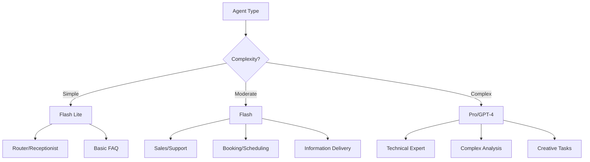

# LLM Configuration Guide for ElevenLabs Agents

## Overview

Selecting the right Language Model and configuring it properly is crucial for agent performance, cost optimization, and user experience. This guide provides comprehensive strategies for LLM selection and configuration.

## Available Models

### Gemini Models (Recommended)

| Model | Best For | Latency | Cost | Context Window |
|-------|----------|---------|------|----------------|
| **Gemini 2.5 Flash Lite** | Simple routing, basic responses | Fastest | Lowest | 32K tokens |
| **Gemini 2.5 Flash** | General conversations, most use cases | Fast | Medium | 1M tokens |
| **Gemini 2.5 Pro** | Complex reasoning, technical support | Moderate | Higher | 2M tokens |

### Other Supported Models

| Model | Strengths | Considerations |
|-------|-----------|----------------|
| **GPT-4** | Complex reasoning, creative tasks | Higher latency, cost |
| **GPT-3.5 Turbo** | Good balance of capability/cost | Less capable than Gemini Flash |
| **Claude 3** | Excellent for detailed analysis | Limited availability |
| **Llama 3** | Open source, customizable | Requires self-hosting |

---

## Model Selection Strategy

### Decision Matrix by Use Case



### Detailed Use Case Mapping

#### Gemini 2.5 Flash Lite
**When to Use:**
- Simple routing decisions
- Basic greetings and farewells
- Yes/no determinations
- Emergency detection
- Status checks

**Configuration:**
```yaml
model: gemini-2.5-flash-lite
temperature: 0.2
max_tokens: 150
top_p: 0.9
```

**Example Agents:**
- Main receptionist
- Initial triage bot
- Status checker
- Simple FAQ responder

#### Gemini 2.5 Flash
**When to Use:**
- Most conversational agents
- Information delivery
- Data collection
- Sales conversations
- Customer support

**Configuration:**
```yaml
model: gemini-2.5-flash
temperature: 0.4
max_tokens: 300
top_p: 0.95
```

**Example Agents:**
- Customer service representative
- Sales consultant
- Appointment scheduler
- Product information specialist

#### Gemini 2.5 Pro
**When to Use:**
- Complex technical support
- Detailed analysis
- Multi-step reasoning
- Code generation/debugging
- Medical/legal contexts requiring precision

**Configuration:**
```yaml
model: gemini-2.5-pro
temperature: 0.3
max_tokens: 500
top_p: 0.9
```

**Example Agents:**
- Senior technical support
- Medical consultation assistant
- Legal document analyzer
- Code debugging assistant

---

## Temperature Configuration

### Understanding Temperature

Temperature controls randomness in responses:
- **0.0**: Deterministic, same response every time
- **0.5**: Balanced creativity and consistency
- **1.0**: Maximum creativity, varied responses

### Temperature by Agent Role

#### Ultra-Low Temperature (0.1-0.3)
**Purpose:** Maximum consistency and predictability

```yaml
# Router Agent
temperature: 0.2
reasoning: "Routing decisions must be consistent"

# Emergency Handler
temperature: 0.1
reasoning: "Critical instructions cannot vary"

# Compliance Agent
temperature: 0.2
reasoning: "Regulatory responses must be exact"
```

#### Low Temperature (0.3-0.4)
**Purpose:** Mostly consistent with slight variation

```yaml
# Information Agent
temperature: 0.35
reasoning: "Accurate information with natural variation"

# Technical Support
temperature: 0.3
reasoning: "Precise troubleshooting steps"

# FAQ Bot
temperature: 0.35
reasoning: "Consistent answers with natural phrasing"
```

#### Medium Temperature (0.4-0.5)
**Purpose:** Natural conversation with good consistency

```yaml
# Customer Service
temperature: 0.45
reasoning: "Natural, helpful responses"

# Appointment Scheduler
temperature: 0.4
reasoning: "Systematic but conversational"

# Product Specialist
temperature: 0.45
reasoning: "Informative yet engaging"
```

#### Higher Temperature (0.5-0.7)
**Purpose:** Creative and varied responses

```yaml
# Sales Agent
temperature: 0.55
reasoning: "Persuasive and adaptive"

# Entertainment Bot
temperature: 0.65
reasoning: "Fun and unpredictable"

# Creative Assistant
temperature: 0.6
reasoning: "Original and engaging content"
```

### Temperature Testing Guide

```markdown
## Testing Temperature Settings

1. Start with recommended temperature
2. Run 10 test conversations with same input
3. Evaluate response variation:
   - Too similar? Increase by 0.05
   - Too random? Decrease by 0.05
4. Find sweet spot for your use case
5. Document final setting with reasoning
```

---

## Token Limits and Optimization

### Understanding Tokens

- **1 token ≈ 4 characters** (English)
- **1 token ≈ 0.75 words** (average)
- Input + Output tokens count toward limit

### Token Budget by Role

#### Minimal (50-150 tokens)
```yaml
# Router Agent
max_tokens: 100
strategy: "Force concise routing decision"
example_response: "I'll connect you with our technical support team right away."
```

#### Standard (150-300 tokens)
```yaml
# Information Agent
max_tokens: 250
strategy: "Complete answers without rambling"
example_response: "Our office hours are Monday through Friday, 
8 AM to 6 PM AEST. We're located at 123 Business St, Sydney. 
You can reach us at 02-1234-5678 for appointments."
```

#### Extended (300-500 tokens)
```yaml
# Technical Support
max_tokens: 400
strategy: "Detailed troubleshooting steps"
example_response: "I understand you're experiencing connection issues. 
Let's troubleshoot this step by step. First, can you check if the 
green light on your modem is solid or blinking? [continues with 
detailed instructions]"
```

#### Comprehensive (500-1000 tokens)
```yaml
# Complex Analysis Agent
max_tokens: 800
strategy: "In-depth explanations and analysis"
use_cases: "Legal analysis, medical consultation, technical architecture"
```

### Token Optimization Strategies

#### 1. Prompt Compression
```markdown
## BEFORE (45 tokens)
You are a helpful customer service representative who works at 
ACME Corporation and helps customers with their questions about 
products and services.

## AFTER (20 tokens)
You are Sam, ACME's customer service rep, helping with product questions.
```

#### 2. Response Instruction
```markdown
## CONCISE RESPONSES
Add to prompt: "Keep responses under 50 words unless specifically asked for details."

## BULLET POINTS
Add to prompt: "Use bullet points for multiple items instead of paragraphs."

## NO REPETITION
Add to prompt: "Don't repeat information already provided by the user."
```

#### 3. Dynamic Token Allocation
```markdown
## ADAPTABILITY
If simple question: Use maximum 100 tokens
If complex question: Use up to 300 tokens
If emergency: Use minimum tokens needed for safety instructions
```

---

## Advanced LLM Parameters

### Top-p (Nucleus Sampling)

Controls the cumulative probability of token selection:

```yaml
# Conservative (0.9)
top_p: 0.9
use_for: "Routers, emergency handlers"
effect: "More predictable responses"

# Balanced (0.95)
top_p: 0.95
use_for: "Most conversational agents"
effect: "Natural variation"

# Creative (1.0)
top_p: 1.0
use_for: "Creative writing, entertainment"
effect: "Maximum variety"
```

### Frequency Penalty

Reduces repetition of tokens:

```yaml
# Low (0.0-0.3)
frequency_penalty: 0.2
use_for: "Technical documentation"
effect: "Allows necessary repetition"

# Medium (0.3-0.6)
frequency_penalty: 0.5
use_for: "General conversation"
effect: "Reduces repetitive phrases"

# High (0.6-1.0)
frequency_penalty: 0.8
use_for: "Creative content"
effect: "Forces variety"
```

### Presence Penalty

Encourages talking about new topics:

```yaml
# Low (0.0-0.3)
presence_penalty: 0.2
use_for: "Focused support agents"
effect: "Stays on topic"

# Medium (0.3-0.6)
presence_penalty: 0.5
use_for: "Sales conversations"
effect: "Explores related topics"

# High (0.6-1.0)
presence_penalty: 0.8
use_for: "Discovery conversations"
effect: "Actively seeks new topics"
```

---

## Model Performance Optimization

### Latency Reduction Strategies

#### 1. Model Selection for Speed
```yaml
priority_order:
  1: gemini-2.5-flash-lite  # ~200ms
  2: gemini-2.5-flash        # ~400ms
  3: gpt-3.5-turbo          # ~600ms
  4: gemini-2.5-pro         # ~800ms
  5: gpt-4                  # ~1200ms
```

#### 2. Streaming Responses
```yaml
streaming: true
first_token_latency: "Optimize for quick first token"
benefits:
  - "User sees immediate response"
  - "Perceived latency reduction"
  - "Better conversation flow"
```

#### 3. Prompt Caching
```yaml
cache_strategy:
  - Cache common questions/responses
  - Pre-load frequently used context
  - Store computed embeddings
```

### Cost Optimization

#### Tiered Model Strategy
```yaml
routing_logic:
  simple_queries: gemini-2.5-flash-lite
  standard_queries: gemini-2.5-flash
  complex_only: gemini-2.5-pro
  
estimated_cost_reduction: "60-70%"
```

#### Token Usage Monitoring
```markdown
## Track and Optimize
1. Monitor average tokens per conversation
2. Identify verbose response patterns
3. Adjust max_tokens progressively
4. Set alerts for unusual usage
```

---

## Configuration Examples

### Example 1: High-Volume Router
```yaml
agent_type: "Main Router"
model: "gemini-2.5-flash-lite"
temperature: 0.2
max_tokens: 100
top_p: 0.9
frequency_penalty: 0.3
presence_penalty: 0.0
reasoning: "Need fast, consistent routing with minimal cost"
```

### Example 2: Conversational Sales Agent
```yaml
agent_type: "Sales Consultant"
model: "gemini-2.5-flash"
temperature: 0.55
max_tokens: 350
top_p: 0.95
frequency_penalty: 0.5
presence_penalty: 0.4
reasoning: "Balance of personality, persuasion, and reliability"
```

### Example 3: Technical Expert System
```yaml
agent_type: "Senior Technical Support"
model: "gemini-2.5-pro"
temperature: 0.25
max_tokens: 500
top_p: 0.9
frequency_penalty: 0.2
presence_penalty: 0.1
reasoning: "Accuracy and detail critical, cost secondary"
```

### Example 4: Entertainment Bot
```yaml
agent_type: "Quiz Master"
model: "gemini-2.5-flash"
temperature: 0.65
max_tokens: 200
top_p: 1.0
frequency_penalty: 0.7
presence_penalty: 0.6
reasoning: "Maximum variety and engagement"
```

---

## Testing and Validation

### A/B Testing Framework
```markdown
## Test Protocol
1. Create two versions with different settings
2. Run 50 conversations each
3. Measure:
   - Response quality (human evaluation)
   - Task completion rate
   - User satisfaction
   - Average response time
   - Token usage
   - Cost per conversation
4. Statistical significance test
5. Deploy winning configuration
```

### Performance Metrics
```yaml
key_metrics:
  - first_response_time: "< 1 second"
  - average_response_time: "< 2 seconds"
  - task_completion_rate: "> 85%"
  - user_satisfaction: "> 4.5/5"
  - cost_per_conversation: "< $0.05"
  - token_efficiency: "< 500 total"
```

### Monitoring Dashboard
```markdown
## Essential Metrics to Track
- Model usage distribution
- Temperature effectiveness
- Token consumption patterns
- Response time percentiles
- Error rates by model
- Cost trends
- User feedback correlation
```

---

## Troubleshooting Guide

### Common Issues and Solutions

| Issue | Likely Cause | Solution |
|-------|-------------|----------|
| Responses too similar | Temperature too low | Increase by 0.1 |
| Inconsistent routing | Temperature too high | Decrease to 0.2-0.3 |
| Cut-off responses | Token limit too low | Increase max_tokens |
| High costs | Wrong model selection | Downgrade where possible |
| Slow responses | Model too complex | Use Flash Lite for simple tasks |
| Hallucinations | Temperature too high | Reduce to 0.3-0.4 |
| Repetitive phrases | No frequency penalty | Set to 0.3-0.5 |

---

## Best Practices Checklist

- [ ] Start with Flash for most agents
- [ ] Use Flash Lite for simple routing
- [ ] Reserve Pro for complex reasoning only
- [ ] Test temperature in 0.05 increments
- [ ] Monitor token usage weekly
- [ ] Set cost alerts
- [ ] Document configuration decisions
- [ ] A/B test major changes
- [ ] Review performance metrics monthly
- [ ] Optimize progressively, not drastically

---

*Next: Master dynamic content with variables → [05-VARIABLES_AND_DYNAMICS.md](05-VARIABLES_AND_DYNAMICS.md)*