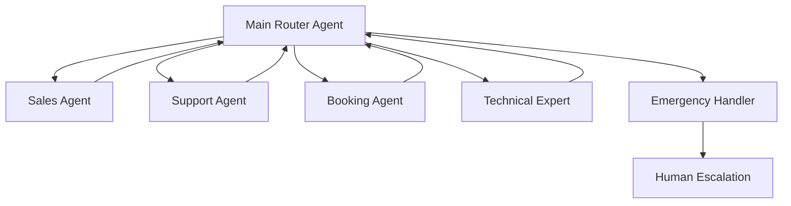
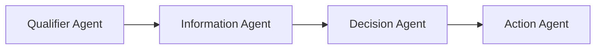
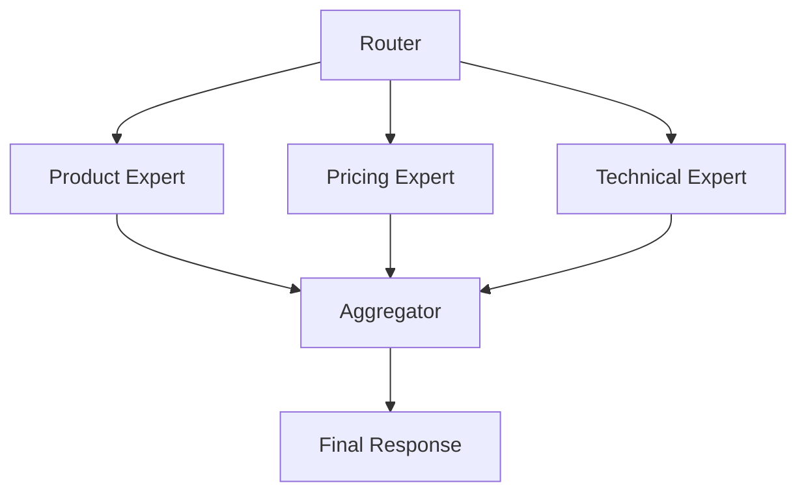

# Multi-Agent Architecture Design for ElevenLabs

## Overview

Multi-agent systems allow you to create specialized agents that work together, providing better user experience and more maintainable systems than trying to build one complex agent that does everything.

## Core Design Patterns

### 1. Hub-and-Spoke Pattern (Most Common)



**Benefits:**
- Clear separation of concerns
- Easy to maintain and update
- Predictable user journey
- Simple to debug

**Implementation:**
```markdown
## MAIN ROUTER AGENT
Model: Gemini 2.5 Flash Lite
Temperature: 0.2
Role: Identify need and route quickly

## SPECIALIST AGENTS
Each with specific expertise:
- Sales: Product knowledge, pricing
- Support: Troubleshooting, help
- Booking: Scheduling, availability
- Technical: Deep technical knowledge
```

### 2. Sequential Flow Pattern



**Use Cases:**
- Complex sales funnels
- Medical triage systems
- Loan applications
- Insurance claims

### 3. Parallel Specialist Pattern



**Use Cases:**
- Complex queries requiring multiple expertise
- Research and analysis
- Comprehensive consultations

---

## Designing Your Multi-Agent System

### Step 1: Identify Agent Boundaries

```yaml
Questions to Ask:
  - What are the distinct conversation types?
  - What expertise is needed for each?
  - Where do conversations naturally branch?
  - What requires different tones/personalities?
  
Example Analysis:
  Customer Calls:
    - 40% are bookings → Booking Agent
    - 30% are support → Support Agent
    - 20% are sales → Sales Agent
    - 10% are other → Human Escalation
```

### Step 2: Define Agent Specializations

#### Router Agent (The Gatekeeper)
```markdown
## SPECIALIZATION
- Minimal model (Flash Lite)
- Low temperature (0.2)
- Quick decision making
- No detailed knowledge needed
- Focus: Accurate routing only

## KEY METRICS
- Average routing time: < 20 seconds
- Routing accuracy: > 95%
- Token usage: < 100 per conversation
```

#### Specialist Agents
```markdown
## BOOKING SPECIALIST
Knowledge: Calendar, availability, services
Skills: Date/time handling, conflict resolution
Personality: Organized, efficient

## TECHNICAL EXPERT
Knowledge: Product specifications, troubleshooting
Skills: Problem diagnosis, solution explanation
Personality: Patient, educational

## SALES CONSULTANT
Knowledge: Products, pricing, competitors
Skills: Need identification, objection handling
Personality: Enthusiastic, consultative
```

### Step 3: Design Transfer Logic

#### Natural Language Conditions
```yaml
booking_triggers:
  - "book an appointment"
  - "schedule a meeting"
  - "availability"
  - "when can you"
  - "next available"
  
support_triggers:
  - "not working"
  - "broken"
  - "help with"
  - "issue"
  - "problem"
  
sales_triggers:
  - "pricing"
  - "how much"
  - "features"
  - "compare"
  - "purchase"
```

#### Transfer Decision Tree
```markdown
## ROUTER LOGIC
1. Listen for keywords/intent
2. If multiple matches, ask clarifying question
3. If no match, collect info for callback
4. Transfer with context message

## TRANSFER MESSAGES
To Booking: "I'll connect you with our scheduling specialist..."
To Support: "Let me get our technical expert to help..."
To Sales: "Our product specialist can answer that..."
```

---

## Implementation Guide

### Configuration Requirements

#### 1. Enable "First Message" on All Receiving Agents
```yaml
CRITICAL: Every agent that receives transfers must have:
  - First Message: Enabled ✓
  - Message Text: Contextual greeting
  
Example First Messages:
  Booking: "Hi! I understand you'd like to schedule an appointment."
  Support: "Hello! I'm here to help with your technical issue."
  Sales: "Hi there! I'd be happy to help you find the right solution."
```

#### 2. Transfer Tool Configuration
```javascript
// Transfer to AI Agent
{
  "tool_type": "transfer_to_ai_agent",
  "agent_id": "agent_8801k2px9ch5ee2bs65xwwhdzcjq",
  "condition": "User wants to book or schedule",
  "transfer_message": "Connecting you to our booking specialist...",
  "pass_context": true
}

// Transfer to Human
{
  "tool_type": "transfer_to_number",
  "phone_number": "+61412345678",
  "condition": "Emergency or unresolved issue",
  "transfer_message": "This needs immediate attention. Transferring..."
}
```

### Agent Communication

#### Context Preservation
```markdown
## PASSING CONTEXT
When transferring, include:
- What was discussed
- Customer information collected
- Reason for transfer
- Any urgency indicators

## CONTEXT MESSAGE TEMPLATE
"Customer calling about [issue/need]. 
They've mentioned [key points].
Transferring because [reason]."
```

#### Preventing Transfer Loops
```markdown
## ANTI-LOOP STRATEGIES
1. Track previous agents in conversation
2. Don't transfer back to referring agent
3. Maximum 2 transfers before human escalation
4. Each agent must progress conversation

## IN ADAPTABILITY SECTION
If transferred from {{previous_agent}}:
  - Don't transfer back
  - Must resolve or escalate to human
  - Acknowledge the transfer
```

---

## Real-World Architectures

### Example 1: Plumbing Service Multi-Agent System

```yaml
Agents:
  main_receptionist:
    model: gemini-2.5-flash-lite
    temperature: 0.2
    purpose: Route calls quickly
    transfers_to: [booking, emergency, info, sales]
  
  booking_specialist:
    model: gemini-2.5-flash
    temperature: 0.4
    purpose: Schedule service appointments
    knowledge: Calendar, service types, coverage areas
    transfers_to: [main_receptionist, emergency]
  
  emergency_handler:
    model: gemini-2.5-flash-lite
    temperature: 0.2
    purpose: Handle urgent situations
    transfers_to: [human_emergency_line]
  
  info_specialist:
    model: gemini-2.5-flash
    temperature: 0.35
    purpose: Answer service questions
    knowledge: Services, pricing, coverage
    transfers_to: [booking, main_receptionist]
  
  sales_agent:
    model: gemini-2.5-flash
    temperature: 0.5
    purpose: Commercial quotes and contracts
    transfers_to: [booking, main_receptionist]
```

### Example 2: Healthcare Multi-Agent System

```yaml
Agents:
  medical_receptionist:
    purpose: Initial triage and routing
    routes_to:
      - appointment_scheduler
      - prescription_refills
      - test_results
      - emergency_triage
  
  appointment_scheduler:
    purpose: Book medical appointments
    capabilities:
      - Check doctor availability
      - Handle rescheduling
      - Waitlist management
  
  prescription_refills:
    purpose: Medication refill requests
    capabilities:
      - Verify prescription history
      - Check refill eligibility
      - Send to pharmacy
  
  emergency_triage:
    purpose: Assess medical urgency
    capabilities:
      - Ask diagnostic questions
      - Determine urgency level
      - Direct to appropriate care
```

### Example 3: E-commerce Support System

```yaml
Agents:
  customer_service_router:
    routes_based_on:
      - Order status → order_tracker
      - Returns → returns_processor
      - Product questions → product_expert
      - Technical issues → tech_support
      - Complaints → escalation_manager
  
  order_tracker:
    integrations: [shipping_api, order_database]
    capabilities: [track_package, delivery_estimates]
  
  returns_processor:
    integrations: [returns_system, refund_api]
    capabilities: [initiate_return, generate_label]
  
  product_expert:
    knowledge_base: product_catalog
    capabilities: [specifications, comparisons, recommendations]
```

---

## Transfer Configuration Details

### Setting Up Transfers

#### 1. In Agent Configuration
```yaml
Tools Section:
  transfer_to_ai_agent:
    enabled: true
    targets:
      - agent_id: "agent_abc123"
        name: "Booking Specialist"
        condition: "appointment, schedule, booking"
      - agent_id: "agent_def456"
        name: "Technical Support"
        condition: "problem, issue, not working"
```

#### 2. Transfer Conditions Best Practices
```markdown
## GOOD CONDITIONS (Specific)
"User mentions booking, appointment, schedule, calendar, 
availability, or asks when someone can visit"

## BAD CONDITIONS (Too Vague)
"User needs help"
```

#### 3. Transfer Messages
```markdown
## SMOOTH TRANSFER MESSAGES
Before: "I understand you need [specific thing]."
During: "I'll connect you with our [specialist type] who can help with that."
After: [New agent picks up seamlessly]

## CONTEXT-AWARE TRANSFERS
"I'll transfer you to our booking specialist. They have 
access to our real-time calendar and can find the perfect time."
```

---

## Performance Optimization

### Model Selection by Role

```yaml
Router Agents:
  model: gemini-2.5-flash-lite
  why: Speed and cost critical, simple decisions
  
Information Agents:
  model: gemini-2.5-flash
  why: Balance of capability and cost
  
Complex Specialists:
  model: gemini-2.5-pro
  why: Need reasoning and detailed knowledge
  
Emergency Handlers:
  model: gemini-2.5-flash-lite
  why: Speed critical, simple instructions
```

### Token Optimization

```markdown
## TOKEN BUDGET BY AGENT TYPE
Router: 50-100 tokens (force brevity)
Specialist: 200-400 tokens (detailed responses)
Emergency: 100-150 tokens (clear instructions)

## OPTIMIZATION STRATEGIES
1. Router uses minimal prompt
2. Specialists have full knowledge
3. Share common context via variables
4. Don't duplicate information
```

---

## Testing Multi-Agent Systems

### Test Scenarios

```markdown
## ESSENTIAL TEST CASES
1. Happy path for each specialist
2. Transfer from router to each agent
3. Transfer between specialists
4. Multiple transfers in conversation
5. Failed transfer handling
6. Loop prevention
7. Emergency escalation
8. After-hours routing
9. Unknown request handling
10. Context preservation verification
```

### Testing Checklist

```markdown
## PRE-LAUNCH CHECKLIST
- [ ] All agent IDs are correct
- [ ] Transfer conditions tested
- [ ] First Message enabled on all agents
- [ ] Transfer messages are smooth
- [ ] No transfer loops possible
- [ ] Emergency path works
- [ ] Context passes correctly
- [ ] Fallback to human works
- [ ] Each agent has clear boundaries
- [ ] Performance metrics acceptable
```

---

## Common Pitfalls and Solutions

| Problem | Cause | Solution |
|---------|-------|----------|
| Transfer loops | Agents transfer back and forth | Add loop detection logic |
| Lost context | Information not passed | Enable context preservation |
| Slow routing | Router too complex | Simplify to Flash Lite |
| Wrong transfers | Vague conditions | Make conditions specific |
| No first message | Setting not enabled | Enable on all receivers |
| Customer confusion | Poor transfer messages | Clear handoff explanation |

---

## Monitoring and Analytics

### Key Metrics

```yaml
Router Performance:
  - Average routing time
  - Routing accuracy
  - Transfer success rate
  
Specialist Performance:
  - Resolution rate
  - Average handling time
  - Customer satisfaction
  
System Performance:
  - Total conversation time
  - Number of transfers
  - Escalation rate
```

### Dashboard Setup

```markdown
## MONITORING DASHBOARD
Track:
1. Transfer flow diagram with counts
2. Agent utilization rates
3. Failed transfer alerts
4. Loop detection warnings
5. Average transfers per conversation
6. Time to resolution by path
```

---

## Scaling Considerations

### When to Add More Agents

```markdown
## INDICATORS FOR NEW AGENT
- Single agent handling >3 distinct tasks
- Conversation times increasing
- Transfer accuracy decreasing
- Customer satisfaction dropping
- Specific expertise needed frequently
```

### When to Consolidate Agents

```markdown
## INDICATORS FOR CONSOLIDATION
- Agents with <10% utilization
- Very similar knowledge/skills
- Excessive transfers
- Maintenance overhead high
- Customer confusion about options
```

---

*Next: Configure voice and audio settings → [07-VOICE_AND_AUDIO.md](07-VOICE_AND_AUDIO.md)*