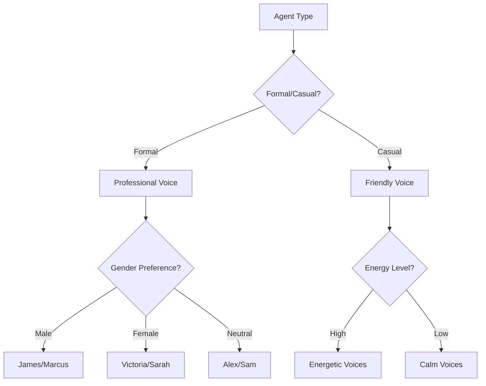

# Voice and Audio Configuration Guide for ElevenLabs Agents

## Overview

Voice selection and audio configuration are critical for creating believable, engaging AI agents. The right voice with proper settings can make the difference between a robotic interaction and a natural conversation.

## Voice Selection Strategy

### Understanding Voice Types

#### Pre-made Voices
**Best for:** Quick deployment, consistent quality, proven performance

| Voice Category | Use Cases | Characteristics |
|----------------|-----------|-----------------|
| **Professional** | Business, support, sales | Clear, neutral accent, authoritative |
| **Friendly** | Customer service, hospitality | Warm, approachable, patient |
| **Energetic** | Entertainment, marketing | Upbeat, enthusiastic, engaging |
| **Calm** | Healthcare, meditation, crisis | Soothing, measured, reassuring |
| **Technical** | IT support, tutorials | Precise, clear, methodical |

#### Voice Cloning
**Best for:** Brand consistency, specific requirements, unique identity

```yaml
Cloning Options:
  Instant Clone:
    - 1-3 minutes of audio
    - Good quality
    - Quick setup
    
  Professional Clone:
    - 30+ minutes of audio
    - Highest quality
    - Studio-grade results
```

### Voice Selection Matrix



---

## Voice Configuration Parameters

### Core Voice Settings

#### Stability Slider (0.0 - 1.0)
Controls consistency vs expressiveness:

```yaml
stability_settings:
  0.0-0.3:
    description: "Maximum expressiveness"
    use_for: "Entertainment, storytelling"
    pros: "Dynamic, emotional range"
    cons: "Less predictable"
    
  0.4-0.6:
    description: "Balanced"
    use_for: "General conversation, sales"
    pros: "Natural variation"
    cons: "Moderate consistency"
    
  0.7-1.0:
    description: "Maximum consistency"
    use_for: "Announcements, instructions"
    pros: "Predictable, professional"
    cons: "Can sound monotonous"

recommended_default: 0.5
```

#### Similarity Boost (0.0 - 1.0)
Enhances voice characteristics:

```yaml
similarity_boost:
  0.0-0.3:
    effect: "More generic voice"
    use_when: "Blending voices"
    
  0.4-0.6:
    effect: "Moderate enhancement"
    use_when: "Natural conversation"
    
  0.7-1.0:
    effect: "Strong voice character"
    use_when: "Brand voice consistency"
    
recommended_default: 0.8
```

#### Style Exaggeration (0.0 - 1.0)
Amplifies speaking style:

```yaml
style_settings:
  0.0:
    description: "No style modification"
    latency: "Lowest"
    use_for: "Speed critical"
    
  0.1-0.3:
    description: "Subtle enhancement"
    latency: "Minimal impact"
    use_for: "Professional agents"
    
  0.4-0.7:
    description: "Noticeable style"
    latency: "Moderate increase"
    use_for: "Character voices"
    
  0.8-1.0:
    description: "Maximum style"
    latency: "Higher latency"
    use_for: "Entertainment only"

recommended_default: 0.0  # For real-time conversation
```

#### Speaker Boost
Enhances similarity to original speaker:

```yaml
speaker_boost:
  enabled: true
  impact: "Slight latency increase"
  benefit: "Better voice consistency"
  recommendation: "Enable for cloned voices"
```

### Speed Control (0.25 - 4.0)
Adjust speaking pace:

```yaml
speed_settings:
  0.25-0.7:
    description: "Slower than normal"
    use_for: "Elderly audience, complex info"
    
  0.8-0.9:
    description: "Slightly slow"
    use_for: "Clear enunciation needed"
    
  1.0:
    description: "Normal speed"
    use_for: "Standard conversation"
    
  1.1-1.3:
    description: "Slightly fast"
    use_for: "Energetic delivery"
    
  1.4-2.0:
    description: "Fast"
    use_for: "Time-critical, disclaimers"

recommended_range: 0.9-1.1
```

---

## Audio Output Configuration

### Output Format Selection

#### For Real-Time Conversation

```yaml
pcm_16000:
  sample_rate: "16 kHz"
  format: "PCM"
  use_case: "Phone quality, low latency"
  bandwidth: "~256 kbps"
  latency: "Lowest"
  quality: "Good for speech"
  recommendation: "BEST FOR AGENTS"

pcm_22050:
  sample_rate: "22.05 kHz"
  format: "PCM"
  use_case: "Better quality, still fast"
  bandwidth: "~353 kbps"
  latency: "Very low"
  quality: "Very good"

pcm_8000:
  sample_rate: "8 kHz"
  format: "PCM"
  use_case: "Ultra-low bandwidth"
  bandwidth: "~128 kbps"
  latency: "Lowest"
  quality: "Basic telephony"
```

#### For Streaming/Recording

```yaml
mp3_44100_128:
  sample_rate: "44.1 kHz"
  bitrate: "128 kbps"
  use_case: "Standard streaming"
  quality: "Good"
  file_size: "~1 MB/min"

mp3_44100_192:
  sample_rate: "44.1 kHz"
  bitrate: "192 kbps"
  use_case: "High quality streaming"
  quality: "Excellent"
  file_size: "~1.4 MB/min"
  requirement: "Creator tier+"
```

#### For Telephony

```yaml
ulaw_8000:
  format: "μ-law"
  sample_rate: "8 kHz"
  use_case: "Twilio, telephony"
  compatibility: "Universal"
  quality: "Phone standard"

alaw_8000:
  format: "A-law"
  sample_rate: "8 kHz"
  use_case: "European telephony"
  compatibility: "EU/International"
  quality: "Phone standard"
```

### Optimization for Latency

```markdown
## LATENCY OPTIMIZATION CHECKLIST
- [ ] Use PCM 16000 Hz for output
- [ ] Set style to 0 (disabled)
- [ ] Disable speaker boost if not needed
- [ ] Choose Flash Lite model when possible
- [ ] Optimize streaming settings
- [ ] Use appropriate voice (pre-made faster than cloned)
- [ ] Minimize voice processing effects
```

---

## Voice Selection by Agent Type

### Router/Receptionist
```yaml
voice_profile:
  type: "Professional"
  gender: "Neutral preferred"
  characteristics:
    - Clear enunciation
    - Neutral accent
    - Moderate pace
    - Friendly but efficient
  
settings:
  stability: 0.6
  similarity_boost: 0.7
  style: 0.0
  speed: 1.0
  output_format: "pcm_16000"
  
examples:
  male: "James", "Marcus"
  female: "Sarah", "Victoria"
  neutral: "Alex", "Sam"
```

### Sales Agent
```yaml
voice_profile:
  type: "Energetic Professional"
  characteristics:
    - Enthusiastic
    - Confident
    - Persuasive
    - Adaptable energy
  
settings:
  stability: 0.4
  similarity_boost: 0.8
  style: 0.2
  speed: 1.05
  output_format: "pcm_16000"
  
tone_variations:
  discovery: "Curious, interested"
  presentation: "Confident, knowledgeable"
  closing: "Assured, supportive"
```

### Technical Support
```yaml
voice_profile:
  type: "Patient Expert"
  characteristics:
    - Clear and methodical
    - Patient
    - Technically precise
    - Reassuring
  
settings:
  stability: 0.7
  similarity_boost: 0.8
  style: 0.0
  speed: 0.95
  output_format: "pcm_16000"
  
adaptations:
  frustrated_customer: "Extra calm, slower"
  technical_user: "Normal pace, precise"
  emergency: "Urgent but controlled"
```

### Healthcare Agent
```yaml
voice_profile:
  type: "Compassionate Professional"
  characteristics:
    - Warm and empathetic
    - Clear medical terminology
    - Patient-focused
    - Calming presence
  
settings:
  stability: 0.8
  similarity_boost: 0.9
  style: 0.0
  speed: 0.9
  output_format: "pcm_16000"
  
considerations:
  - Extra clarity for elderly
  - Slower pace for instructions
  - Reassuring tone for anxiety
```

### Emergency Handler
```yaml
voice_profile:
  type: "Calm Authority"
  characteristics:
    - Absolutely clear
    - Calm under pressure
    - Authoritative
    - Reassuring
  
settings:
  stability: 0.9
  similarity_boost: 0.9
  style: 0.0
  speed: 0.85
  output_format: "pcm_16000"
  
critical_requirements:
  - Maximum clarity
  - No ambiguity
  - Repeat critical info
  - Stay calm always
```

---

## Regional and Cultural Considerations

### Accent Selection

#### Australian Market
```yaml
voice_requirements:
  primary: "Australian accent preferred"
  acceptable: "Neutral International"
  avoid: "Strong regional US/UK"
  
terminology:
  - "Mobile" not "Cell phone"
  - "CBD" not "Downtown"
  - "Chemist" not "Pharmacy"
  - "GP" not "Primary care"
```

#### US Market
```yaml
voice_requirements:
  primary: "General American"
  regional_options:
    - Southern: "Hospitality, warmth"
    - Midwest: "Neutral, trustworthy"
    - West Coast: "Tech, modern"
  avoid: "Heavy regional accents"
```

#### International
```yaml
voice_requirements:
  primary: "Neutral International English"
  characteristics:
    - Clear enunciation
    - Moderate pace
    - Minimal idioms
    - Standard vocabulary
```

### Cultural Sensitivity

```markdown
## CULTURAL CONSIDERATIONS

### Pace and Pausing
- Asian markets: Comfortable with pauses
- Western markets: Minimize silence
- Middle East: More formal pace

### Formality Level
- Japanese market: High formality
- Australian market: Casual professional
- German market: Direct and efficient

### Gender Preferences
- Consider market preferences
- Offer choice when possible
- Default to neutral options
```

---

## Voice Testing Protocol

### Pre-Launch Testing

```markdown
## VOICE TESTING CHECKLIST

### 1. Clarity Test
- [ ] Test with background noise
- [ ] Test over phone lines
- [ ] Test with poor connections
- [ ] Verify all words clear

### 2. Consistency Test
- [ ] Run 10 identical inputs
- [ ] Check voice consistency
- [ ] Verify stability settings
- [ ] Test across time periods

### 3. Cultural Appropriateness
- [ ] Native speaker review
- [ ] Accent appropriateness
- [ ] Terminology check
- [ ] Tone matching

### 4. Performance Test
- [ ] Measure first byte latency
- [ ] Check streaming smoothness
- [ ] Test under load
- [ ] Verify failover behavior

### 5. Emotion Range Test
- [ ] Test empathy responses
- [ ] Test excitement delivery
- [ ] Test serious topics
- [ ] Verify adaptability
```

### A/B Testing Voices

```yaml
test_protocol:
  sample_size: 100 conversations
  metrics:
    - User satisfaction score
    - Conversation completion rate
    - Average handling time
    - Transfer/escalation rate
    
  variations:
    A: 
      voice: "Professional male"
      stability: 0.7
    B:
      voice: "Professional female"
      stability: 0.7
    C:
      voice: "Neutral voice"
      stability: 0.5
      
  analysis:
    - Statistical significance
    - Demographic preferences
    - Use case performance
    - Cost/performance ratio
```

---

## Advanced Voice Techniques

### Dynamic Voice Adjustment

```markdown
## ADAPTABILITY WITH VOICE

### Based on Time of Day
Morning (6 AM - 12 PM):
  - Slightly higher energy
  - Cheerful greeting
  - Speed: 1.0

Afternoon (12 PM - 6 PM):
  - Moderate energy
  - Professional tone
  - Speed: 1.0

Evening (6 PM - 10 PM):
  - Calmer delivery
  - Relaxed pace
  - Speed: 0.95

### Based on Customer State
If frustrated:
  - Lower pitch
  - Slower pace (0.9x)
  - Higher stability (0.8)
  
If confused:
  - Clearer enunciation
  - Slower pace (0.85x)
  - More pauses
  
If in a hurry:
  - Faster pace (1.1x)
  - Skip fillers
  - Direct delivery
```

### Voice Blending for Uniqueness

```yaml
creating_unique_voice:
  base_voice: "Professional Sarah"
  modifications:
    stability: 0.45
    similarity_boost: 0.6
    style: 0.15
    
  result: "Unique brand voice"
  
  benefits:
    - Brand differentiation
    - Memorable interactions
    - Consistent identity
```

---

## Troubleshooting Voice Issues

### Common Problems and Solutions

| Issue | Possible Cause | Solution |
|-------|---------------|----------|
| Robotic sound | Stability too high | Reduce to 0.4-0.5 |
| Inconsistent voice | Stability too low | Increase to 0.6-0.7 |
| Slow response | High-quality format | Switch to PCM 16000 |
| Muffled audio | Low sample rate | Increase to 22050+ |
| Cutting out | Network issues | Enable buffering |
| Wrong emotion | Style settings | Adjust style parameter |
| Too fast/slow | Speed setting | Adjust between 0.9-1.1 |

### Performance Optimization

```markdown
## OPTIMIZATION PRIORITY

1. **Latency Critical** (Emergency, Router)
   - PCM 8000 or 16000
   - Style: 0
   - No speaker boost
   - Pre-made voices only

2. **Balanced** (Support, Sales)
   - PCM 16000
   - Style: 0-0.2
   - Speaker boost optional
   - Any voice type

3. **Quality Priority** (Healthcare, Premium)
   - PCM 22050 or MP3
   - Style: 0-0.3
   - Speaker boost enabled
   - Cloned voices OK
```

---

## Voice Monitoring and Analytics

### Key Metrics to Track

```yaml
voice_metrics:
  quality:
    - User satisfaction ratings
    - Voice clarity feedback
    - Emotion appropriateness
    
  performance:
    - Time to first byte
    - Audio stream stability
    - Dropout frequency
    
  usage:
    - Voice selection distribution
    - Format usage
    - Settings correlation with success
```

### Continuous Improvement

```markdown
## MONTHLY VOICE REVIEW

1. Analyze conversation transcripts
2. Review user feedback on voice
3. Check performance metrics
4. Test new voice options
5. Adjust settings based on data
6. Document changes and impacts
```

---

## Best Practices Summary

### Do's ✅
- Test voices with target audience
- Use PCM 16000 for real-time agents
- Match voice to brand identity
- Consider cultural preferences
- Monitor and optimize regularly
- Keep stability between 0.4-0.7
- Document voice configuration

### Don'ts ❌
- Use maximum style for production
- Ignore latency impacts
- Change voices frequently
- Use extreme speed settings
- Forget regional preferences
- Neglect A/B testing
- Assume one voice fits all

---

## Configuration Templates

### Standard Business Agent
```yaml
voice_configuration:
  voice_id: "professional_sarah_au"
  stability: 0.5
  similarity_boost: 0.8
  style: 0.0
  speaker_boost: true
  speed: 1.0
  output_format: "pcm_16000"
```

### Premium Support Agent
```yaml
voice_configuration:
  voice_id: "custom_cloned_voice"
  stability: 0.6
  similarity_boost: 0.9
  style: 0.1
  speaker_boost: true
  speed: 0.95
  output_format: "pcm_22050"
```

### Emergency Response
```yaml
voice_configuration:
  voice_id: "calm_authority_voice"
  stability: 0.8
  similarity_boost: 0.9
  style: 0.0
  speaker_boost: false
  speed: 0.9
  output_format: "pcm_16000"
```

---

*Next: Configure tools and integrations → [08-TOOLS_AND_INTEGRATIONS.md](08-TOOLS_AND_INTEGRATIONS.md)*