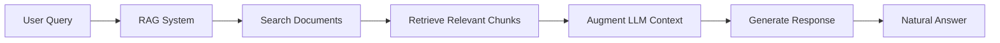

# Knowledge Base and RAG Configuration for ElevenLabs Agents

## Overview

Knowledge bases with Retrieval-Augmented Generation (RAG) enable your agents to access and intelligently search through large amounts of information, providing accurate, contextual responses based on your organization's documentation.

## Understanding RAG

### What is RAG?

Retrieval-Augmented Generation combines:
1. **Retrieval**: Finding relevant information from documents
2. **Augmentation**: Enhancing the LLM's knowledge with retrieved content
3. **Generation**: Creating natural responses using the found information



### Benefits of RAG

- **Accuracy**: Responses based on actual documentation
- **Currency**: Easy to update without retraining
- **Specificity**: Organization-specific information
- **Traceability**: Can cite sources
- **Cost-effective**: No model fine-tuning needed

---

## Knowledge Base Setup

### Supported File Formats

| Format | Best For | Limitations | Max Size |
|--------|----------|-------------|----------|
| **PDF** | Manuals, guides, reports | May lose formatting | 50MB |
| **DOCX** | Documents, procedures | Complex layouts may break | 25MB |
| **TXT** | Simple text, logs, FAQs | No formatting | 10MB |
| **HTML** | Web content, help articles | JavaScript not executed | 10MB |
| **EPUB** | Books, long-form content | Limited support | 25MB |

### File Preparation Best Practices

#### 1. Document Structure

```markdown
## GOOD DOCUMENT STRUCTURE

# Clear Main Heading
## Logical Section Headers
### Subsection with Specific Topic

- Bullet points for lists
- Clear, concise information
- One topic per section

**Important:** Key information highlighted
*Note:* Additional context in italics

## BAD DOCUMENT STRUCTURE

Everything in one paragraph with no structure making
it hard for RAG to identify relevant chunks and the
information becomes difficult to retrieve accurately
when users ask specific questions about topics that
are buried in long blocks of text.
```

#### 2. Content Optimization

```markdown
## OPTIMIZATION CHECKLIST

### Before Upload
- [ ] Remove outdated information
- [ ] Fix spelling and grammar
- [ ] Add section headers
- [ ] Break long paragraphs
- [ ] Include keywords naturally
- [ ] Add metadata where possible

### Content Structure
- [ ] Executive summary at top
- [ ] Table of contents for long docs
- [ ] Glossary for technical terms
- [ ] FAQ section
- [ ] Index of key topics

### Formatting
- [ ] Use consistent heading hierarchy
- [ ] Bullet points for lists
- [ ] Tables for structured data
- [ ] Clear section breaks
- [ ] Avoid walls of text
```

#### 3. File Naming Convention

```yaml
naming_structure:
  pattern: "[category]_[topic]_[version]_[date].[ext]"
  
examples:
  - "product_pricing_v2_2024-01.pdf"
  - "support_troubleshooting_v1_2024-02.docx"
  - "policy_returns_v3_2024-01.txt"
  - "faq_general_v1_2024-03.html"
  
benefits:
  - Easy to identify content
  - Version tracking
  - Automated organization
  - Quick updates
```

---

## Uploading and Managing Knowledge

### Upload Methods

#### 1. Dashboard Upload (Recommended)
```markdown
## DASHBOARD UPLOAD STEPS
1. Navigate to Agent Settings
2. Click Knowledge Base tab
3. Click "Add Knowledge"
4. Select file(s) - max 5 at once
5. Wait for processing (1-5 minutes)
6. Enable RAG toggle
7. Test with sample queries
```

#### 2. API Upload
```javascript
// ElevenLabs API Upload
const uploadKnowledge = async (agentId, file) => {
  const formData = new FormData();
  formData.append('file', file);
  formData.append('name', 'Product Documentation');
  formData.append('description', 'Latest product specs');
  
  const response = await fetch(
    `https://api.elevenlabs.io/v1/convai/agents/${agentId}/knowledge`,
    {
      method: 'POST',
      headers: {
        'xi-api-key': API_KEY
      },
      body: formData
    }
  );
  
  return response.json();
};
```

#### 3. URL Import
```yaml
url_import:
  supported:
    - Static HTML pages
    - Public documentation sites
    - Blog posts
    - Help articles
    
  not_supported:
    - Dynamic JavaScript sites
    - Authenticated content
    - Real-time data
    - Interactive elements
```

### Knowledge Organization

#### Categories and Tags

```yaml
knowledge_structure:
  products:
    files:
      - product_catalog.pdf
      - specifications.docx
      - pricing_guide.txt
    tags: ["products", "catalog", "pricing"]
    
  support:
    files:
      - troubleshooting.pdf
      - user_manual.docx
      - faq.html
    tags: ["support", "help", "troubleshooting"]
    
  policies:
    files:
      - terms_conditions.pdf
      - privacy_policy.docx
      - return_policy.txt
    tags: ["legal", "policies", "terms"]
```

#### Version Management

```markdown
## VERSION CONTROL STRATEGY

### Naming Convention
- v1.0 - Major release
- v1.1 - Minor updates
- v1.1.1 - Patches/fixes

### Update Process
1. Upload new version with version number
2. Test with agent in sandbox
3. Remove old version
4. Monitor for issues
5. Keep backup of previous version

### Change Log
Document what changed:
- v2.0: Complete pricing restructure
- v1.2: Added new product line
- v1.1: Fixed technical specifications
```

---

## RAG Configuration

### Enabling RAG

```yaml
rag_settings:
  enabled: true
  
  search_parameters:
    chunk_size: 512  # tokens per chunk
    overlap: 128     # overlap between chunks
    top_k: 5        # number of results to retrieve
    
  relevance_threshold: 0.7  # minimum similarity score
  
  response_settings:
    cite_sources: true
    confidence_threshold: 0.8
    fallback_behavior: "acknowledge_limitation"
```

### Search Optimization

#### 1. Chunk Size Configuration

```markdown
## CHUNK SIZE GUIDELINES

### Small Chunks (256-512 tokens)
✅ Pros:
- More precise retrieval
- Better for specific facts
- Lower token usage

❌ Cons:
- May miss context
- More chunks to search

Use for: FAQs, specifications, prices

### Medium Chunks (512-1024 tokens)
✅ Pros:
- Balanced precision and context
- Good for most use cases
- Reasonable token usage

❌ Cons:
- Moderate precision

Use for: General documentation, procedures

### Large Chunks (1024-2048 tokens)
✅ Pros:
- Full context preserved
- Good for complex topics
- Fewer searches needed

❌ Cons:
- Less precise
- Higher token usage
- May include irrelevant info

Use for: Policies, detailed guides
```

#### 2. Retrieval Strategies

```yaml
retrieval_strategies:
  semantic_search:
    description: "Find conceptually similar content"
    use_for: "General questions, concepts"
    example: "What's your return policy?" → Finds return-related content
    
  keyword_matching:
    description: "Exact term matching"
    use_for: "Product names, codes, specific terms"
    example: "Model XR-1000" → Finds exact model references
    
  hybrid_approach:
    description: "Combines semantic and keyword"
    use_for: "Best overall performance"
    configuration:
      semantic_weight: 0.7
      keyword_weight: 0.3
```

### Prompt Integration with RAG

```markdown
## PERSONA
You are Sarah, a Customer Service Agent with access to comprehensive 
company documentation through the knowledge base.

## GOAL
PRIMARY: Answer customer questions accurately using the knowledge base.
SECONDARY: If information isn't in knowledge base, acknowledge and escalate.

## CONTEXT
- Knowledge base contains: Products, policies, procedures, FAQs
- Last updated: Daily
- RAG enabled for intelligent search

## ADAPTABILITY
When searching knowledge base:
1. Parse customer question for key terms
2. Search knowledge base
3. If found with high confidence (>0.8):
   - Provide accurate answer
   - Cite the source document
   - Ask if they need more detail
4. If found with medium confidence (0.5-0.8):
   - Provide answer with caveat
   - Offer to verify with specialist
5. If not found or low confidence (<0.5):
   - Acknowledge limitation
   - Offer alternatives
   - Collect question for knowledge base update

Example responses:
HIGH CONFIDENCE: "According to our Product Guide, the XR-1000 
has a 5-year warranty covering parts and labor."

MEDIUM CONFIDENCE: "Based on our documentation, it appears 
this might be covered under warranty, but let me connect 
you with a specialist to confirm."

LOW/NO CONFIDENCE: "I don't have specific information about 
that in my current documentation. Let me connect you with 
someone who can provide accurate details."
```

---

## Content Types and Optimization

### 1. Product Information

```markdown
## PRODUCT DOCUMENTATION STRUCTURE

# Product Name: [Model Number]

## Overview
- Brief description
- Key features
- Target audience

## Specifications
| Feature | Details |
|---------|---------|
| Dimensions | X x Y x Z |
| Weight | XX kg |
| Power | XXX watts |

## Pricing
- Retail: $XXX
- Bulk: Contact sales
- Warranty: X years

## Common Questions
Q: Is this compatible with...?
A: Yes, it works with...

## Troubleshooting
Problem: Won't turn on
Solution: Check power connection...
```

### 2. FAQs

```markdown
## FAQ OPTIMIZATION

### Structure Each Q&A
**Question:** [Exact question as customers ask]
**Answer:** [Clear, concise response]
**Related:** [Link to detailed documentation]

### Example:
**Question:** How do I return a product?
**Answer:** Returns are accepted within 30 days of purchase 
with receipt. Visit our store or ship to our returns center 
at [address]. Refunds process within 5-7 business days.
**Related:** See Return Policy document for full details.

### Grouping
- Group related questions
- Use clear categories
- Include variations of same question
- Add keywords naturally
```

### 3. Troubleshooting Guides

```markdown
## TROUBLESHOOTING FORMAT

### Problem: [Specific Issue]
**Symptoms:**
- Symptom 1
- Symptom 2

**Possible Causes:**
1. Cause A
2. Cause B

**Solutions:**
1. Try this first (quick fix)
2. If that doesn't work, try this
3. If still not resolved, do this

**When to Escalate:**
- If solutions don't work
- If safety concern
- If warranty issue

**Reference:** Error codes in Appendix A
```

### 4. Policies and Procedures

```markdown
## POLICY DOCUMENTATION

# [Policy Name]
**Effective Date:** [Date]
**Version:** [X.X]

## Summary
[One paragraph overview]

## Full Policy
### Section 1: [Topic]
[Detailed policy text]

### Section 2: [Topic]
[Detailed policy text]

## Quick Reference
- Key Point 1
- Key Point 2
- Key Point 3

## Exceptions
- Exception case 1
- Exception case 2

## Contact
For questions: [contact info]
```

---

## Testing and Validation

### RAG Testing Protocol

```markdown
## TESTING CHECKLIST

### 1. Upload Testing
- [ ] Upload each file type
- [ ] Verify processing completion
- [ ] Check for errors
- [ ] Confirm indexing

### 2. Retrieval Testing
- [ ] Test exact product names
- [ ] Test conceptual questions
- [ ] Test policy questions
- [ ] Test edge cases

### 3. Accuracy Testing
Sample Questions:
- [ ] "What's the warranty on XR-1000?"
- [ ] "How do I return a product?"
- [ ] "What are your business hours?"
- [ ] "Do you ship internationally?"

Expected vs Actual:
| Question | Expected | Actual | Pass/Fail |
|----------|----------|--------|-----------|
| Warranty | 5 years | [test] | [ ] |
| Returns | 30 days | [test] | [ ] |

### 4. Confidence Testing
- [ ] High confidence responses accurate?
- [ ] Medium confidence appropriately cautious?
- [ ] Low confidence triggers escalation?
- [ ] No hallucinations when info missing?

### 5. Source Citation
- [ ] Sources cited correctly?
- [ ] Document names accurate?
- [ ] Confidence levels shown?
```

### Common RAG Issues and Solutions

| Issue | Cause | Solution |
|-------|-------|----------|
| Wrong information retrieved | Poor document structure | Restructure with clear sections |
| Low confidence scores | Vague queries | Improve query parsing in prompt |
| Slow retrieval | Large documents | Split into smaller files |
| Missing information | Not in knowledge base | Add comprehensive FAQ |
| Conflicting information | Multiple versions | Remove old versions |
| Hallucinations | RAG disabled or failing | Ensure RAG enabled, check logs |

---

## Advanced RAG Techniques

### 1. Multi-Document Synthesis

```markdown
## HANDLING MULTIPLE SOURCES

When RAG returns multiple relevant documents:

1. **Prioritize by Recency**
   - Check document dates
   - Use most recent for policies
   - Note if information conflicts

2. **Combine Complementary Info**
   - Product specs from catalog
   - Pricing from price list
   - Warranty from policy doc

3. **Handle Conflicts**
   - If documents conflict, acknowledge
   - Escalate for clarification
   - Don't guess or average

Example Response:
"I found information in multiple documents. According to 
our Product Catalog (updated January 2024), the warranty 
is 5 years. Our Warranty Policy (updated February 2024) 
confirms this and adds that it covers parts and labor."
```

### 2. Query Expansion

```markdown
## IMPROVING SEARCH WITH QUERY EXPANSION

Original Query: "broken"

Expanded Search Terms:
- broken
- not working
- malfunction
- defective
- damaged
- faulty
- issue
- problem

Implementation in Prompt:
"When customer uses vague terms, expand search:
- 'broken' → search for troubleshooting, repairs, warranty
- 'cost' → search for pricing, fees, charges
- 'help' → search for support, guide, manual"
```

### 3. Contextual RAG

```yaml
contextual_rag:
  conversation_context:
    - Previous questions in session
    - Customer type (new/existing)
    - Product mentioned earlier
    
  search_modification:
    - If discussing product X, prioritize X documents
    - If previous question about pricing, weight pricing docs
    - If frustrated customer, prioritize quick solutions
    
  example:
    question_1: "Tell me about the XR-1000"
    rag_search_1: "XR-1000 specifications features"
    
    question_2: "What's the warranty?"
    rag_search_2: "XR-1000 warranty" # Includes context
```

---

## Maintenance and Updates

### Regular Maintenance Schedule

```markdown
## KNOWLEDGE BASE MAINTENANCE

### Daily
- [ ] Check error logs
- [ ] Monitor confidence scores
- [ ] Review failed searches

### Weekly
- [ ] Update FAQs based on common questions
- [ ] Add new products/services
- [ ] Remove outdated promotions

### Monthly
- [ ] Full content review
- [ ] Update all policies
- [ ] Restructure poor-performing docs
- [ ] Archive old versions

### Quarterly
- [ ] Complete knowledge audit
- [ ] User feedback integration
- [ ] Performance optimization
- [ ] RAG configuration tuning
```

### Knowledge Gap Analysis

```yaml
gap_analysis:
  tracking:
    - Questions with no results
    - Low confidence responses
    - Escalation reasons
    - Customer feedback
    
  monthly_review:
    top_missing_topics:
      - Topic 1: 15 requests
      - Topic 2: 12 requests
      - Topic 3: 8 requests
    
  action_items:
    - Create documentation for top gaps
    - Expand existing docs
    - Add FAQ entries
    - Update search keywords
```

---

## Performance Optimization

### Speed Optimization

```markdown
## IMPROVING RAG SPEED

### Document Level
1. Split large documents (>10MB)
2. Remove images from text docs
3. Use consistent formatting
4. Index frequently accessed docs

### Query Level
1. Pre-filter by category
2. Limit search scope when possible
3. Cache common queries
4. Use async retrieval

### System Level
1. Optimize chunk size
2. Adjust top_k parameter
3. Set appropriate timeouts
4. Monitor and scale resources
```

### Token Optimization

```yaml
token_optimization:
  strategies:
    selective_retrieval:
      description: "Only retrieve when needed"
      implementation: "Check if question needs knowledge base"
      savings: "30-40%"
      
    smart_chunking:
      description: "Optimal chunk sizes"
      implementation: "512 tokens for most docs"
      savings: "20-25%"
      
    result_limiting:
      description: "Retrieve only top 3 chunks"
      implementation: "Set top_k = 3"
      savings: "40%"
      
    summary_mode:
      description: "Summarize long responses"
      implementation: "Extract key points only"
      savings: "30-50%"
```

---

## Security and Compliance

### Data Security

```markdown
## KNOWLEDGE BASE SECURITY

### Access Control
- [ ] Limit who can upload documents
- [ ] Audit trail for changes
- [ ] Version control with rollback
- [ ] Regular access reviews

### Content Security
- [ ] No passwords in documents
- [ ] No personal customer data
- [ ] Redact sensitive information
- [ ] Encrypt documents at rest

### Compliance
- [ ] GDPR compliance for EU data
- [ ] HIPAA for healthcare info
- [ ] PCI DSS for payment info
- [ ] Regular compliance audits
```

### Information Governance

```yaml
governance_policy:
  classification:
    public: "Product info, general FAQs"
    internal: "Procedures, guidelines"
    confidential: "Pricing strategies, contracts"
    restricted: "Customer data, financials"
    
  handling:
    public: "Can be in knowledge base"
    internal: "Limit to internal agents"
    confidential: "Require approval"
    restricted: "Never in knowledge base"
    
  retention:
    current_docs: "Keep active"
    superseded: "Archive for 1 year"
    obsolete: "Delete after 2 years"
```

---

## Best Practices Summary

### Do's ✅
- Structure documents clearly
- Update regularly
- Test retrieval accuracy
- Monitor performance
- Cite sources in responses
- Handle low confidence appropriately
- Version control documents
- Optimize for common queries

### Don'ts ❌
- Upload unstructured documents
- Include outdated information
- Ignore failed searches
- Allow hallucinations
- Forget to enable RAG
- Mix versions of documents
- Include sensitive data
- Rely on RAG for everything

---

*Next: Master transfer configuration → [10-TRANSFER_CONFIGURATION.md](10-TRANSFER_CONFIGURATION.md)*