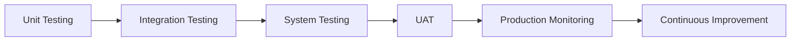

# Testing and Quality Assurance Guide for ElevenLabs Agents

## Overview

Comprehensive testing ensures your agents perform reliably, handle edge cases gracefully, and deliver consistent user experiences. This guide covers testing strategies, quality metrics, and continuous improvement processes.

## Testing Framework

### Testing Phases



### Testing Pyramid

```yaml
testing_levels:
  unit_tests:
    scope: "Individual components"
    frequency: "Every change"
    automation: "High"
    examples:
      - Prompt sections
      - Transfer conditions
      - Validation rules
      
  integration_tests:
    scope: "Component interactions"
    frequency: "Daily"
    automation: "Medium"
    examples:
      - Agent transfers
      - Tool usage
      - Data flow
      
  system_tests:
    scope: "End-to-end scenarios"
    frequency: "Weekly"
    automation: "Low"
    examples:
      - Complete customer journeys
      - Multi-agent workflows
      - Edge cases
      
  user_acceptance:
    scope: "Business requirements"
    frequency: "Per release"
    automation: "None"
    examples:
      - Stakeholder review
      - Customer feedback
      - Performance metrics
```

---

## Unit Testing Components

### Prompt Section Testing

```markdown
## PERSONA TESTING

Test Cases:
1. Verify agent introduces with correct name
2. Confirm role is stated accurately
3. Check credentials mentioned appropriately

Test Script:
"Who are you?"
Expected: States name and role

"What are your qualifications?"
Expected: Mentions relevant experience

## GOAL TESTING

Test Cases:
1. Primary goal achievable
2. Secondary goal triggers correctly
3. Tertiary goal as last resort

Test Script:
"I need help with [primary goal topic]"
Expected: Attempts primary goal

"That won't work for me"
Expected: Moves to secondary goal

## TONE TESTING

Test Cases:
1. Appropriate formality level
2. Consistent voice throughout
3. Adaptability triggers work

Test Script:
[Normal interaction]
Expected: Standard professional tone

"I'm really frustrated!"
Expected: More empathetic tone
```

### Variable Testing

```yaml
variable_tests:
  system_variables:
    test_cases:
      - variable: "{{system__time}}"
        expected: "Current time displayed"
        
      - variable: "{{system__caller_id}}"
        expected: "Phone number or 'unknown'"
        
      - variable: "{{system__conversation_id}}"
        expected: "Unique ID string"
        
  custom_variables:
    test_cases:
      - variable: "{{business_hours}}"
        provided: "9 AM - 5 PM"
        expected: "Uses provided value"
        
      - variable: "{{undefined_var}}"
        provided: null
        expected: "Handles gracefully"
```

### Transfer Condition Testing

```markdown
## TRANSFER TRIGGER TESTING

### Booking Transfer
Test Inputs:
- "I need an appointment" → Should transfer ✓
- "Schedule a meeting" → Should transfer ✓
- "When are you available" → Should transfer ✓
- "Book me in" → Should transfer ✓
- "I have a booking" → Should NOT transfer ✗

### Support Transfer
Test Inputs:
- "It's broken" → Should transfer ✓
- "Not working" → Should transfer ✓
- "Need help" → Should transfer ✓
- "Technical issue" → Should transfer ✓
- "How does it work" → Might transfer ?

### Emergency Transfer
Test Inputs:
- "Fire!" → Immediate transfer ✓
- "Medical emergency" → Immediate transfer ✓
- "Urgent help" → Check severity first ?
- "Important" → Should NOT transfer ✗
```

---

## Integration Testing

### Agent-to-Agent Handoffs

```yaml
handoff_test_scenarios:
  scenario_1:
    name: "Router to Specialist"
    steps:
      1: "Start with router"
      2: "Say booking trigger"
      3: "Verify transfer message"
      4: "Confirm specialist receives"
      5: "Check context preserved"
    expected:
      - "Smooth transition"
      - "No repeated questions"
      - "Context available"
      
  scenario_2:
    name: "Specialist to Human"
    steps:
      1: "Start with specialist"
      2: "Request escalation"
      3: "Verify acknowledgment"
      4: "Confirm number dialed"
      5: "Check handoff message"
    expected:
      - "Clear escalation"
      - "Context summary"
      - "Warm transfer"
```

### Tool Integration Tests

```markdown
## KNOWLEDGE BASE INTEGRATION

Test 1: Information Retrieval
Input: "What's your return policy?"
Expected: 
- Searches knowledge base
- Finds relevant document
- Provides accurate answer
- Cites source

Test 2: Missing Information
Input: "Do you sell quantum computers?"
Expected:
- Searches knowledge base
- Finds no results
- Acknowledges limitation
- Offers alternative

## WEBHOOK INTEGRATION

Test 1: Successful Call
Trigger: Complete booking
Expected:
- Webhook fires
- Receives confirmation
- Provides reference number

Test 2: Webhook Failure
Trigger: Webhook timeout
Expected:
- Recognizes failure
- Collects information anyway
- Promises manual follow-up
```

### Data Flow Testing

```yaml
data_flow_tests:
  collection_to_storage:
    test: "Collect customer data"
    verify:
      - Data collected correctly
      - Validation applied
      - Stored in correct format
      - Available for retrieval
      
  transfer_context:
    test: "Transfer with context"
    verify:
      - Context packaged correctly
      - Transferred completely
      - Received accurately
      - Used appropriately
      
  evaluation_pipeline:
    test: "Complete conversation"
    verify:
      - Evaluation triggers
      - Criteria applied correctly
      - Results stored
      - Analytics updated
```

---

## System Testing

### End-to-End Scenarios

```markdown
## SCENARIO 1: COMPLETE BOOKING FLOW

1. Customer calls main line
2. Router answers and greets
3. Customer: "I need to schedule a service"
4. Router transfers to booking
5. Booking agent greets with context
6. Collects: Name, email, phone, date, service
7. Validates each field
8. Checks availability via webhook
9. Confirms appointment
10. Sends confirmation email
11. Ends call appropriately

Success Criteria:
- All steps complete
- Data accurate
- Confirmation sent
- Customer satisfied
- Evaluation positive
```

```markdown
## SCENARIO 2: TECHNICAL SUPPORT ESCALATION

1. Customer calls with issue
2. Router identifies technical need
3. Transfers to support
4. Support attempts troubleshooting
5. Issue complex, needs escalation
6. Customer frustrated
7. Agent acknowledges frustration
8. Escalates to human
9. Provides context to human
10. Stays on line for warm transfer

Success Criteria:
- Proper routing
- Troubleshooting attempted
- Emotion recognized
- Smooth escalation
- Context preserved
```

### Edge Case Testing

```yaml
edge_cases:
  conversation_interruptions:
    - Customer disconnects mid-transfer
    - Network failure during data collection
    - Agent timeout during processing
    - Multiple simultaneous speakers
    
  unusual_requests:
    - Speaking different language
    - Asking unrelated questions
    - Providing invalid data repeatedly
    - Refusing to provide information
    
  system_limits:
    - Very long conversation (>30 min)
    - Rapid repeated calls
    - Maximum transfer limit reached
    - All specialists unavailable
    
  emotional_scenarios:
    - Extremely angry customer
    - Crying/distressed caller
    - Threatening behavior
    - Inappropriate language
```

---

## Performance Testing

### Load Testing

```yaml
load_test_configuration:
  concurrent_conversations:
    baseline: 10
    normal: 50
    peak: 100
    stress: 200
    
  metrics_to_measure:
    - Response time
    - First word latency
    - Transfer success rate
    - Tool execution time
    - Error rate
    
  performance_targets:
    response_time: "< 2 seconds"
    first_word: "< 500ms"
    transfer_success: "> 95%"
    tool_execution: "< 5 seconds"
    error_rate: "< 1%"
```

### Stress Testing

```markdown
## STRESS TEST SCENARIOS

### Rapid Fire Questions
Test: Ask 10 questions in quick succession
Expected: Handles each appropriately

### Long Monologue
Test: Speak continuously for 2 minutes
Expected: Waits, then responds appropriately

### Repeated Transfers
Test: Transfer between 5 agents
Expected: Prevents loops, escalates to human

### Data Overload
Test: Provide 50+ data points
Expected: Collects relevant, ignores excess

### Simultaneous Tools
Test: Trigger 5 tools at once
Expected: Queues appropriately, completes all
```

---

## Quality Metrics

### Key Performance Indicators

```yaml
primary_kpis:
  effectiveness:
    first_call_resolution: "> 80%"
    correct_routing_rate: "> 95%"
    task_completion_rate: "> 85%"
    
  efficiency:
    average_handling_time: "< 5 minutes"
    transfer_rate: "< 30%"
    escalation_rate: "< 15%"
    
  experience:
    customer_satisfaction: "> 4.5/5"
    agent_rating: "> 90%"
    recommendation_score: "> 8/10"
    
  technical:
    uptime: "> 99.9%"
    response_time: "< 2s"
    error_rate: "< 0.1%"
```

### Quality Scoring Framework

```markdown
## CONVERSATION QUALITY SCORE

### Components (100 points total)

1. Task Completion (30 points)
   - Primary goal achieved: 20 pts
   - Data collected correctly: 10 pts

2. Interaction Quality (25 points)
   - Appropriate tone: 10 pts
   - Clear communication: 10 pts
   - Professional throughout: 5 pts

3. Technical Performance (20 points)
   - Fast responses: 10 pts
   - Tools work correctly: 10 pts

4. Customer Experience (25 points)
   - Customer satisfied: 15 pts
   - No frustration expressed: 10 pts

### Grading
- 90-100: Excellent
- 80-89: Good
- 70-79: Acceptable
- Below 70: Needs improvement
```

---

## Test Automation

### Automated Test Suite

```python
# Example test automation framework
class AgentTestSuite:
    def test_greeting(self):
        response = agent.send("Hello")
        assert "welcome" in response.lower()
        assert agent.name in response
        
    def test_booking_transfer(self):
        response = agent.send("I need an appointment")
        assert "transfer" in response.lower()
        assert "booking" in response.lower()
        assert agent.transfer_triggered == True
        
    def test_data_validation(self):
        response = agent.send("My email is invalid@")
        assert "valid email" in response.lower()
        assert agent.validation_failed == True
        
    def test_emergency_handling(self):
        response = agent.send("This is an emergency!")
        assert agent.priority == "high"
        assert agent.transfer_target == "emergency_line"
```

### Continuous Testing Pipeline

```yaml
ci_cd_pipeline:
  on_commit:
    - Syntax validation
    - Prompt structure check
    - Variable validation
    
  on_pull_request:
    - Unit tests
    - Integration tests
    - Performance benchmarks
    
  on_deploy_staging:
    - Full system tests
    - Load tests
    - User acceptance tests
    
  on_deploy_production:
    - Smoke tests
    - Health checks
    - Monitor metrics
```

---

## Test Data Management

### Test Data Sets

```yaml
test_data:
  valid_inputs:
    names: ["John Smith", "María García", "李明"]
    emails: ["test@example.com", "user.name@domain.co.uk"]
    phones: ["0412345678", "02-1234-5678", "+61-400-123-456"]
    
  invalid_inputs:
    names: ["", "X", "123", "@#$%"]
    emails: ["notanemail", "@example.com", "test@"]
    phones: ["123", "not-a-phone", "00000000000"]
    
  edge_cases:
    names: ["O'Brien", "von Smith", "Jean-Paul"]
    emails: ["test+tag@example.com", "very.long.email@subdomain.example.com"]
    phones: ["1800-FLOWERS", "13-13-13"]
```

### Conversation Scripts

```markdown
## TEST CONVERSATION LIBRARY

### Happy Path Script
1. "Hello"
2. "I need to book a service"
3. "My name is John Smith"
4. "john@example.com"
5. "0412-345-678"
6. "Next Tuesday"
7. "Morning is better"
8. "Installation service"
9. "Yes, that's correct"
10. "Thank you, goodbye"

### Difficult Customer Script
1. "Your service is terrible!"
2. "I've been waiting for hours"
3. "This is the third time I've called"
4. "I want to speak to a manager"
5. "No, that won't work"
6. "I don't have time for this"
7. [Eventually provides information]

### Technical Issue Script
1. "My system isn't working"
2. "Error code XR-500"
3. "I've tried restarting"
4. "It was working yesterday"
5. "This is affecting my business"
6. "I need this fixed now"
```

---

## Quality Review Process

### Conversation Review Checklist

```markdown
## MANUAL REVIEW CHECKLIST

### Opening
- [ ] Greeted within 3 seconds
- [ ] Introduced self and company
- [ ] Asked how to help

### Understanding
- [ ] Identified need correctly
- [ ] Asked clarifying questions
- [ ] Confirmed understanding

### Resolution
- [ ] Provided appropriate solution
- [ ] Handled objections well
- [ ] Completed required actions

### Closing
- [ ] Confirmed satisfaction
- [ ] Offered additional help
- [ ] Ended appropriately

### Overall
- [ ] Professional throughout
- [ ] Efficient handling
- [ ] Positive experience
```

### Feedback Loop

```yaml
feedback_process:
  collection:
    - Post-conversation survey
    - Agent evaluation results
    - Customer complaints
    - Internal observations
    
  analysis:
    weekly:
      - Review low scores
      - Identify patterns
      - Quick fixes
      
    monthly:
      - Trend analysis
      - Systematic issues
      - Strategic improvements
      
  implementation:
    immediate: "Critical fixes"
    next_sprint: "Prompt updates"
    next_quarter: "Major changes"
    
  validation:
    - Test changes
    - Monitor impact
    - Adjust as needed
```

---

## Production Monitoring

### Real-Time Monitoring

```yaml
monitoring_dashboard:
  health_metrics:
    - Agent availability
    - Response times
    - Error rates
    - Active conversations
    
  alerts:
    critical:
      - Agent offline
      - Error rate > 5%
      - Response time > 5s
      
    warning:
      - Queue depth > 50
      - Transfer failures > 10%
      - Escalation spike
      
  dashboards:
    operations:
      - Live conversation count
      - Queue status
      - Agent performance
      
    business:
      - Conversion rates
      - Customer satisfaction
      - Cost per conversation
```

### Incident Response

```markdown
## INCIDENT RESPONSE PLAYBOOK

### Severity Levels
P1 - Complete outage
P2 - Major functionality broken
P3 - Minor issues
P4 - Cosmetic problems

### Response Process
1. Detect issue (monitoring/user report)
2. Assess severity
3. Notify stakeholders
4. Implement fix or workaround
5. Test resolution
6. Deploy fix
7. Monitor stability
8. Post-mortem analysis

### Rollback Procedure
If new deployment causes issues:
1. Identify regression
2. Confirm rollback decision
3. Revert to previous version
4. Verify stability
5. Investigate root cause
```

---

## Continuous Improvement

### A/B Testing Framework

```yaml
ab_test_example:
  test_name: "Greeting Variation"
  
  variant_a:
    greeting: "Hello! How can I help you today?"
    allocation: 50%
    
  variant_b:
    greeting: "Thanks for calling! What can I do for you?"
    allocation: 50%
    
  metrics:
    - Customer engagement rate
    - Time to issue identification
    - Satisfaction score
    
  duration: "1 week"
  sample_size: 1000
  
  results:
    variant_a: 
      engagement: 82%
      satisfaction: 4.3
    variant_b:
      engagement: 87%
      satisfaction: 4.5
    winner: "variant_b"
```

### Optimization Cycle

```markdown
## MONTHLY OPTIMIZATION PROCESS

Week 1: Analysis
- Review metrics
- Identify improvement areas
- Prioritize changes

Week 2: Development
- Update prompts
- Adjust configurations
- Create test plans

Week 3: Testing
- Run test suites
- User acceptance testing
- Performance validation

Week 4: Deployment
- Staged rollout
- Monitor metrics
- Gather feedback
```

---

## Testing Tools and Resources

### Recommended Tools

```yaml
testing_tools:
  conversation_testing:
    - ElevenLabs Dashboard Tester
    - API Testing via Postman
    - Custom test harness
    
  load_testing:
    - K6 for load generation
    - JMeter for complex scenarios
    - Custom scripts
    
  monitoring:
    - CloudWatch/Datadog
    - Custom dashboards
    - ElevenLabs analytics
    
  analysis:
    - Conversation transcripts
    - Excel/Sheets for metrics
    - BI tools for trends
```

### Test Documentation

```markdown
## TEST DOCUMENTATION TEMPLATE

### Test Case ID: TC-001
**Component:** Booking Agent
**Function:** Date Validation
**Priority:** High

**Preconditions:**
- Agent is active
- Booking system available

**Test Steps:**
1. Say "I want to book for yesterday"
2. Observe response

**Expected Result:**
- Agent recognizes past date
- Politely explains can't book past
- Offers future dates

**Actual Result:** [Fill during test]
**Status:** [Pass/Fail]
**Notes:** [Any observations]
```

---

## Best Practices

### Testing Do's ✅
- Test early and often
- Automate repetitive tests
- Test edge cases thoroughly
- Monitor production constantly
- Document test results
- Include stakeholders in UAT
- Learn from failures
- Celebrate quality improvements

### Testing Don'ts ❌
- Skip testing due to time pressure
- Test only happy paths
- Ignore flaky tests
- Deploy without monitoring
- Forget regression testing
- Assume tests are enough
- Neglect user feedback
- Stop improving

---

*Next: Common pitfalls and how to avoid them → [13-COMMON_PITFALLS.md](13-COMMON_PITFALLS.md)*