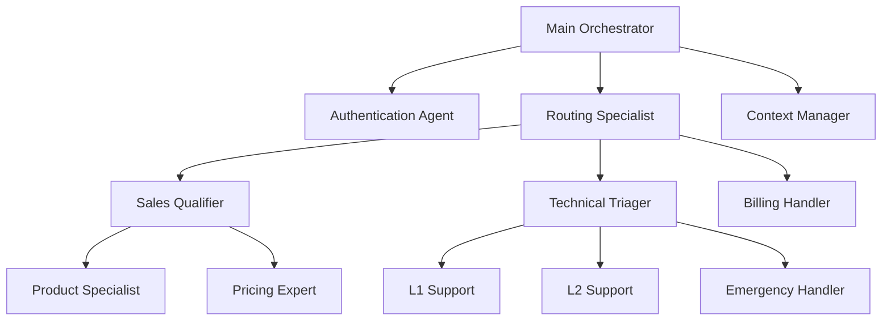

# Advanced Patterns and Techniques for ElevenLabs Agents

## Overview

This guide covers sophisticated techniques for building complex, production-ready agent systems. These patterns solve advanced use cases and optimize for scale, reliability, and user experience.

## Architectural Patterns

### 1. Microservice Agent Architecture

Instead of monolithic agents, break functionality into specialized micro-agents:



#### Implementation Strategy

```yaml
microservice_pattern:
  orchestrator:
    role: "Traffic director and state manager"
    model: "gemini-2.5-flash-lite"
    responsibilities:
      - Initial customer greeting
      - High-level need identification
      - Route to appropriate specialist
      - Maintain conversation state
      
  specialists:
    authentication_agent:
      trigger: "Account access, password reset"
      model: "gemini-2.5-flash"
      security: "High"
      
    sales_qualifier:
      trigger: "Buying signals"
      model: "gemini-2.5-flash"
      data_collection: "BANT"
      
    technical_triager:
      trigger: "Technical issues"
      model: "gemini-2.5-pro"
      knowledge_base: "Technical docs"
```

### 2. State-Aware Conversation Management

Maintain conversation state across transfers and sessions:

```javascript
// Conversation State Schema
const conversationState = {
  id: "conv_abc123",
  customer: {
    id: "cust_456",
    profile: "existing",
    tier: "premium",
    history: ["previous_issues"],
    preferences: {
      communication_style: "direct",
      availability: "weekdays_am"
    }
  },
  context: {
    entry_point: "website_chat",
    referring_page: "/pricing",
    session_duration: 180,
    sentiment: "positive",
    intent: ["pricing_inquiry", "feature_comparison"]
  },
  progress: {
    stage: "qualification",
    data_collected: {
      name: "✓",
      email: "✓", 
      requirements: "partial"
    },
    next_steps: ["demo_scheduling", "proposal_creation"]
  },
  agents: {
    current: "sales_specialist",
    previous: ["router", "product_expert"],
    escalation_path: "sales_manager"
  }
};
```

### 3. Dynamic Prompt Assembly

Build prompts dynamically based on context:

```python
class DynamicPromptBuilder:
    def build_prompt(self, agent_type, customer_context, conversation_state):
        prompt = self.get_base_prompt(agent_type)
        
        # Add customer-specific context
        if customer_context.tier == "premium":
            prompt += self.get_vip_instructions()
            
        if customer_context.history:
            prompt += self.get_history_context(customer_context.history)
            
        # Add conversation context
        if conversation_state.sentiment == "frustrated":
            prompt += self.get_de_escalation_instructions()
            
        if conversation_state.previous_agents:
            prompt += self.get_handoff_context(conversation_state.previous_agents)
            
        return prompt
        
    def get_vip_instructions(self):
        return """
        ## VIP CUSTOMER HANDLING
        - Acknowledge premium status
        - Offer expedited service
        - Provide direct contact options
        - Extra patience and attention
        """
```

---

## Advanced Transfer Patterns

### 4. Intelligent Routing with ML

Use machine learning to optimize routing decisions:

```yaml
ml_routing:
  features:
    - customer_tier
    - issue_complexity
    - agent_specialization
    - current_load
    - historical_success_rate
    - time_of_day
    - customer_sentiment
    
  model_training:
    data_sources:
      - conversation_outcomes
      - transfer_success_rates
      - customer_satisfaction
      - resolution_times
      
    features_engineering:
      - issue_categorization
      - customer_embeddings
      - agent_skill_vectors
      - temporal_patterns
      
  prediction_targets:
    - best_agent_match
    - expected_resolution_time
    - escalation_probability
    - satisfaction_likelihood
```

### 5. Queue-Aware Load Balancing

Distribute load intelligently across agents:

```javascript
class IntelligentLoadBalancer {
  selectAgent(issue_type, customer_priority, current_loads) {
    const availableAgents = this.getAgentsBySkill(issue_type);
    
    return availableAgents
      .filter(agent => agent.capacity > agent.current_load)
      .sort((a, b) => {
        // Weighted scoring
        const scoreA = this.calculateAgentScore(a, customer_priority);
        const scoreB = this.calculateAgentScore(b, customer_priority);
        return scoreB - scoreA;
      })[0];
  }
  
  calculateAgentScore(agent, customer_priority) {
    const utilization = agent.current_load / agent.capacity;
    const efficiency = agent.resolution_rate;
    const specialization = agent.skill_match;
    
    // Lower utilization = higher score
    const loadScore = (1 - utilization) * 0.4;
    const efficiencyScore = efficiency * 0.4;
    const specializationScore = specialization * 0.2;
    
    // VIP customers get priority agents
    const priorityBonus = customer_priority === 'vip' ? 0.2 : 0;
    
    return loadScore + efficiencyScore + specializationScore + priorityBonus;
  }
}
```

### 6. Predictive Escalation

Anticipate when human intervention will be needed:

```yaml
escalation_prediction:
  early_warning_signals:
    conversation_length: "> 10 minutes"
    transfer_count: "> 2"
    repeat_questions: "> 3"
    negative_sentiment: "< -0.5"
    complex_technical_terms: "> 5"
    
  ml_model_features:
    - customer_frustration_indicators
    - issue_complexity_score
    - agent_confidence_level
    - knowledge_base_hit_rate
    - previous_escalation_patterns
    
  proactive_actions:
    high_escalation_risk:
      - prepare_human_context
      - queue_priority_escalation
      - gather_additional_information
      
    medium_risk:
      - increase_agent_attention
      - provide_additional_resources
      - monitor_closely
```

---

## Advanced Personalization

### 7. Behavioral Adaptation

Adapt agent behavior based on customer communication patterns:

```javascript
class BehavioralAdaptation {
  analyzeCustomerStyle(conversation_history) {
    return {
      communication_speed: this.detectPace(conversation_history),
      formality_preference: this.detectFormality(conversation_history),
      detail_preference: this.detectDetailLevel(conversation_history),
      decision_style: this.detectDecisionPattern(conversation_history)
    };
  }
  
  adaptAgentBehavior(customer_style) {
    const adaptations = {};
    
    if (customer_style.communication_speed === 'fast') {
      adaptations.response_style = 'concise';
      adaptations.pace = 'quick';
    }
    
    if (customer_style.formality_preference === 'casual') {
      adaptations.tone = 'friendly_informal';
      adaptations.language = 'conversational';
    }
    
    if (customer_style.detail_preference === 'high') {
      adaptations.explanation_depth = 'comprehensive';
      adaptations.examples = 'multiple';
    }
    
    return adaptations;
  }
}
```

### 8. Dynamic Persona Switching

Change agent personality based on context:

```yaml
persona_switching:
  base_persona: "professional_helpful"
  
  contextual_personas:
    emergency_situation:
      persona: "calm_authoritative"
      traits:
        - urgent_but_controlled
        - clear_instructions
        - safety_focused
        
    frustrated_customer:
      persona: "empathetic_problem_solver"
      traits:
        - acknowledging
        - patient
        - solution_oriented
        
    technical_expert_customer:
      persona: "technical_peer"
      traits:
        - technical_language
        - detailed_explanations
        - respect_for_expertise
        
    vip_customer:
      persona: "premium_concierge"
      traits:
        - attentive
        - accommodating
        - exclusive_options
```

---

## Advanced Tool Integration

### 9. Orchestrated Workflows

Chain multiple tools for complex operations:

```yaml
complex_workflow_example:
  name: "Complete Onboarding"
  
  steps:
    1_authentication:
      tool: "identity_verification"
      input: "customer_id_documents"
      success_condition: "identity_verified == true"
      failure_action: "request_additional_documents"
      
    2_data_collection:
      tool: "comprehensive_profile"
      input: "verified_customer_data"
      parallel_tasks:
        - collect_preferences
        - verify_address
        - check_credit_score
        
    3_product_matching:
      tool: "recommendation_engine"
      input: "customer_profile + preferences"
      ml_model: "product_recommendation_v2"
      
    4_contract_generation:
      tool: "document_automation"
      input: "matched_products + customer_data"
      output: "personalized_contract"
      
    5_digital_signature:
      tool: "e_signature_platform"
      input: "contract + customer_contact"
      
    6_account_activation:
      tool: "system_provisioning"
      input: "signed_contract"
      parallel_tasks:
        - create_accounts
        - send_welcome_email
        - schedule_onboarding_call
        
  error_handling:
    any_step_failure:
      - log_detailed_error
      - notify_human_agent
      - preserve_completed_steps
      - offer_manual_completion
```

### 10. Real-Time External Integrations

Connect to live systems for up-to-date information:

```javascript
class RealTimeIntegrations {
  async getCustomerContext(customerId) {
    const [profile, orders, support, billing] = await Promise.all([
      this.crmAPI.getProfile(customerId),
      this.orderAPI.getRecentOrders(customerId),
      this.supportAPI.getOpenTickets(customerId),
      this.billingAPI.getAccountStatus(customerId)
    ]);
    
    return {
      profile: {
        tier: profile.tier,
        lifetime_value: profile.ltv,
        satisfaction_score: profile.csat
      },
      recent_activity: {
        last_order: orders[0],
        open_tickets: support.filter(t => t.status === 'open'),
        billing_status: billing.status
      },
      context_flags: {
        has_recent_issue: support.length > 0,
        payment_overdue: billing.overdue,
        high_value_customer: profile.ltv > 10000
      }
    };
  }
  
  async updateContextualPrompt(basePrompt, customerContext) {
    let enhancedPrompt = basePrompt;
    
    if (customerContext.context_flags.payment_overdue) {
      enhancedPrompt += `
      ## BILLING ALERT
      Customer has overdue payment. Handle sensitively:
      - Acknowledge if they mention billing
      - Offer payment options
      - Don't restrict service during call
      `;
    }
    
    if (customerContext.context_flags.has_recent_issue) {
      enhancedPrompt += `
      ## RECENT ISSUE CONTEXT
      Open tickets: ${customerContext.recent_activity.open_tickets.map(t => t.summary).join(', ')}
      Reference if relevant to current call.
      `;
    }
    
    return enhancedPrompt;
  }
}
```

---

## Performance Optimization Patterns

### 11. Intelligent Caching

Cache frequent queries and responses:

```yaml
caching_strategy:
  levels:
    response_cache:
      scope: "Identical queries"
      ttl: "1 hour"
      examples:
        - "What are your hours?" 
        - "What's your return policy?"
        
    knowledge_cache:
      scope: "Frequently accessed documents"
      ttl: "24 hours"
      preload: "Top 100 queries"
      
    computation_cache:
      scope: "Complex calculations"
      ttl: "Variable based on data freshness"
      examples:
        - pricing_calculations
        - availability_checks
        - recommendation_results
        
  cache_invalidation:
    content_update: "Clear related caches"
    time_based: "Automatic TTL expiry"
    manual: "Admin cache clear option"
    
  performance_monitoring:
    cache_hit_rate: "> 70%"
    response_time_improvement: "> 50%"
    memory_usage: "< 1GB"
```

### 12. Progressive Response Generation

Stream responses for better perceived performance:

```javascript
class ProgressiveResponse {
  async generateStreamedResponse(query, context) {
    // Send immediate acknowledgment
    this.streamChunk("I understand you're asking about...");
    
    // Start parallel processes
    const [knowledgePromise, contextPromise] = await Promise.all([
      this.searchKnowledgeBase(query),
      this.enrichContext(context)
    ]);
    
    // Stream as information becomes available
    const knowledge = await knowledgePromise;
    if (knowledge.confidence > 0.8) {
      this.streamChunk("Based on our documentation...");
      this.streamChunk(knowledge.summary);
    }
    
    // Additional context
    const enrichedContext = await contextPromise;
    if (enrichedContext.relevant) {
      this.streamChunk("Specifically for your situation...");
      this.streamChunk(enrichedContext.personalized_info);
    }
    
    // Final wrap-up
    this.streamChunk("Is there anything else about this you'd like to know?");
  }
}
```

---

## Advanced Analytics Patterns

### 13. Conversation Intelligence

Extract insights from conversation patterns:

```yaml
conversation_analytics:
  sentiment_tracking:
    real_time: true
    granularity: "sentence_level"
    alerts:
      negative_trend: "3 consecutive negative responses"
      escalation_risk: "sentiment < -0.7"
      
  intent_evolution:
    track: "How customer intent changes during conversation"
    patterns:
      - initial_inquiry → detailed_research → price_comparison → objection_handling → purchase
      - support_request → troubleshooting → escalation → resolution
      
  conversation_paths:
    successful_patterns:
      - identify_common_resolution_paths
      - optimize_for_replication
      
    failure_patterns:
      - detect_abandonment_points
      - identify_confusion_triggers
      - optimize_problematic_flows
      
  predictive_insights:
    next_likely_question: "Based on conversation history"
    optimal_timing: "When to offer upgrades/assistance"
    escalation_probability: "Real-time risk assessment"
```

### 14. Multi-Dimensional Quality Scoring

Comprehensive conversation quality assessment:

```yaml
quality_dimensions:
  effectiveness:
    metrics:
      - goal_achievement_rate: 0.85
      - first_contact_resolution: 0.78
      - customer_effort_score: 8.2
    weight: 0.35
    
  efficiency:
    metrics:
      - average_handling_time: 4.2
      - response_latency: 1.8
      - tool_utilization_rate: 0.92
    weight: 0.25
    
  experience:
    metrics:
      - customer_satisfaction: 4.4
      - emotional_journey: "positive"
      - personalization_score: 0.73
    weight: 0.40
    
  aggregation:
    formula: "weighted_average(dimensions)"
    normalization: "0-100 scale"
    benchmarking: "industry_standards"
```

---

## Security and Compliance Patterns

### 15. Data Privacy by Design

Built-in privacy protection:

```yaml
privacy_framework:
  data_classification:
    public: "Company info, general policies"
    internal: "Process documents, guidelines"  
    confidential: "Customer PII, payment info"
    restricted: "Security credentials, internal systems"
    
  access_controls:
    agent_level:
      basic_agent: ["public", "internal"]
      specialist_agent: ["public", "internal", "customer_pii"]
      admin_agent: ["all_levels"]
      
    data_handling:
      collection: "Minimum necessary"
      processing: "Purpose-limited"
      storage: "Encrypted at rest"
      transmission: "TLS 1.3"
      retention: "Policy-defined"
      deletion: "Automated expiry"
      
  compliance_checks:
    gdpr_compliance:
      consent_tracking: true
      right_to_deletion: true
      data_portability: true
      
    hipaa_compliance:
      phi_encryption: true
      access_logging: true
      business_associate_agreements: true
```

### 16. Security Monitoring

Real-time security threat detection:

```javascript
class SecurityMonitor {
  detectThreats(conversation) {
    const threats = [];
    
    // Detect social engineering attempts
    if (this.detectSocialEngineering(conversation)) {
      threats.push({
        type: 'social_engineering',
        risk: 'high',
        action: 'escalate_security_team'
      });
    }
    
    // Detect data exfiltration attempts
    if (this.detectDataExtraction(conversation)) {
      threats.push({
        type: 'data_exfiltration',
        risk: 'critical',
        action: 'terminate_session'
      });
    }
    
    // Detect abuse patterns
    if (this.detectAbuse(conversation)) {
      threats.push({
        type: 'abuse',
        risk: 'medium',
        action: 'flag_for_review'
      });
    }
    
    return threats;
  }
  
  detectSocialEngineering(conversation) {
    const redFlags = [
      'urgent security update required',
      'verify your password',
      'system maintenance credentials',
      'temporary access needed'
    ];
    
    return redFlags.some(flag => 
      conversation.customer_messages.some(msg => 
        msg.toLowerCase().includes(flag)
      )
    );
  }
}
```

---

## Scaling Patterns

### 17. Multi-Tenant Architecture

Support multiple brands/organizations:

```yaml
multi_tenant_design:
  tenant_isolation:
    data: "Complete separation per tenant"
    agents: "Tenant-specific configurations"
    knowledge: "Isolated knowledge bases"
    analytics: "Separate reporting"
    
  shared_services:
    infrastructure: "Common platform"
    core_models: "Shared LLM access"
    monitoring: "Centralized observability"
    
  tenant_configuration:
    branding:
      company_name: "{{tenant.company_name}}"
      brand_voice: "{{tenant.brand_voice}}"
      color_scheme: "{{tenant.colors}}"
      
    business_rules:
      working_hours: "{{tenant.business_hours}}"
      escalation_numbers: "{{tenant.escalation_contacts}}"
      policies: "{{tenant.policies}}"
      
    customization:
      agent_personas: "Tenant-specific"
      knowledge_base: "Tenant-specific"
      integrations: "Tenant APIs"
```

### 18. Global Distribution

Deploy agents across regions:

```yaml
global_architecture:
  regions:
    north_america:
      primary: "us-east-1"
      secondary: "us-west-2"
      languages: ["en", "es", "fr"]
      
    europe:
      primary: "eu-west-1"
      secondary: "eu-central-1"
      languages: ["en", "de", "fr", "it", "es"]
      
    asia_pacific:
      primary: "ap-southeast-1"
      secondary: "ap-northeast-1"
      languages: ["en", "zh", "ja", "ko"]
      
  routing_logic:
    primary: "Geographic proximity"
    fallback: "Load-based routing"
    failover: "Cross-region backup"
    
  data_sovereignty:
    eu_data: "Stays in EU regions"
    asia_data: "Stays in APAC regions"
    global_data: "Configurable routing"
```

---

## Innovation Patterns

### 19. Continuous Learning

Agents that improve from interactions:

```yaml
learning_system:
  feedback_loops:
    explicit_feedback:
      - customer_satisfaction_scores
      - agent_performance_ratings
      - manual_corrections
      
    implicit_feedback:
      - conversation_outcomes
      - customer_behavior_patterns
      - resolution_success_rates
      
  learning_mechanisms:
    prompt_optimization:
      - a_b_test_variations
      - gradient_based_improvement
      - evolutionary_optimization
      
    knowledge_expansion:
      - auto_generate_faqs
      - identify_knowledge_gaps
      - suggest_content_updates
      
    behavior_adaptation:
      - personalization_learning
      - context_awareness
      - predictive_routing
      
  safety_measures:
    human_oversight: "Required for critical changes"
    rollback_capability: "Instant reversion if issues"
    gradual_deployment: "Controlled rollout process"
```

### 20. Experimental Framework

Systematic innovation testing:

```yaml
experiment_framework:
  hypothesis_driven:
    example: "Shorter responses will improve satisfaction"
    
  controlled_testing:
    population_split: "50/50 A/B test"
    isolation: "No cross-contamination"
    duration: "Statistical significance"
    
  measurement:
    primary_metrics: ["satisfaction_score"]
    secondary_metrics: ["response_time", "completion_rate"]
    guardrail_metrics: ["error_rate", "escalation_rate"]
    
  decision_framework:
    success_criteria: "Primary metric +5%, no guardrail degradation"
    failure_criteria: "No improvement or guardrail breach"
    learning_criteria: "Document insights regardless of outcome"
```

---

## Future-Proofing Patterns

### 21. Modular Architecture

Build for easy evolution:

```yaml
modular_design:
  core_framework:
    - conversation_manager
    - prompt_engine
    - tool_orchestrator
    - analytics_collector
    
  pluggable_components:
    - llm_providers
    - voice_engines
    - knowledge_stores
    - integration_adapters
    
  versioning_strategy:
    semantic_versioning: "Major.Minor.Patch"
    backward_compatibility: "N-1 version support"
    migration_tools: "Automated upgrade paths"
    
  evolution_support:
    feature_flags: "Enable/disable capabilities"
    configuration_management: "Runtime adjustments"
    hot_swapping: "Zero-downtime updates"
```

---

*Next: Complete examples library → [15-EXAMPLES_LIBRARY.md](15-EXAMPLES_LIBRARY.md)*